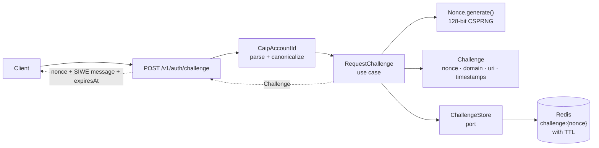

# Project Journal — Wallet Authentication Backend

## How this journal is maintained

- **Lean on git, tests, CLAUDE.md, and ARCHITECTURE.md for the mechanical record.**
  This journal captures what those can't: the *why*, the rejected alternatives, and the lessons.
- **Part 1** is updated only when the project's structure changes (new milestone, package added, roadmap revised).
- **Part 2** gets a new entry per step, written as part of the **same commit** as the code it describes — never as an afterthought.

---

## Part 1 — Big Picture

### What this backend does

This backend proves that a client controls the private key of a crypto wallet, then issues a login session. Its defining property is that it is **protocol-driven, not SDK-driven**: every wallet client — Reown AppKit, MetaMask, raw WalletConnect, or anything built later — reduces to the same three inputs: a `message`, a `signature`, and a claimed `accountId`. No wallet vendor's code or concepts appear anywhere in this backend. The protocol used for V1 is SIWE (EIP-4361), restricted to EVM chains and EOA (normal) wallets.

---

### M0 challenge-request flow

---

### Package map

| Package          | Job                                                                 | Milestone    |
|------------------|---------------------------------------------------------------------|--------------|
| `identity`       | `CaipAccountId`, `Namespace` — the wallet identity model            | M0 ✅        |
| `challenge`      | `Challenge`, `Nonce`, `ChallengeStore` (port), `ChallengePolicy`, `SiweMessageFactory` | M0 ✅ |
| `usecase`        | `RequestChallenge` (M0), `VerifyAndAuthenticate` (M1), `RefreshSession` + `Logout` (M2) | M1 partial ✅ |
| `infrastructure` | Redis adapters (`RedisChallengeStore`), JPA entities + repos, Flyway migrations, `JwtConfiguration`, `Web3jChainClient` (RPC adapter) | M3 ✅ |
| `config`         | Composition root — wires use cases to infrastructure, supplies `Clock`, `ChallengePolicy`, `JwtService` beans | M1 ✅ |
| `api`            | REST controllers, request/response DTOs                             | M2 ✅ |
| `verification`   | `SignatureVerifier` (interface), `EthereumSignatureVerifier` (EOA), `ContractAwareSignatureVerifier` (dispatcher), `ChainClient` (port), `Eip6492Envelope` (6492 gate), SIWE parser | M3 ✅ |
| `session`        | `JwtPolicy`, `JwtService` (access JWT); `RefreshTokenStore` (port), refresh token logic | M2 ✅ |
| `security`       | Spring Security config; `JwtAuthenticationFilter`                   | M2 ✅ |

---

### Roadmap

| Milestone | Goal | Status |
|-----------|------|--------|
| **M0** | Project skeleton; CAIP-10 identity; Redis challenge store with atomic nonce; `/challenge` endpoint; docker-compose; ArchUnit guard | ✅ |
| **M1** | SIWE parsing + full field validation; EOA `ecrecover`; signer-equals-claim check; identity upsert; access JWT. First end-to-end login | ✅ |
| **M2** | Refresh tokens; rotation; reuse detection (family revocation); logout; JWT filter + protected endpoints | ✅ |
| **M3a** | EIP-1271 deployed smart-contract wallets; `ChainClient` port + `Web3jChainClient` adapter; `ContractAwareSignatureVerifier` dispatcher; RPC dependency introduced single-module | ✅ |
| **M3b** | EIP-6492 counterfactual wallets; `Eip6492Envelope` well-formedness gate; `isValidSignatureDeployless` via deployless `eth_call` to `ValidateSigOffchain` universal validator | ✅ |
| **M4** | Second namespace (Solana / Ed25519) to prove and harden the abstraction; only then a real protocol registry | ⬜ unscoped |

Cross-cutting from M1 onward: rate limiting, audit logging, Testcontainers integration tests for the full auth flow.

---

## Part 2 — Step Log

---

## M4 · piece 1.5 — ArchUnit layer-boundary guard   (commit 0ff42ea)

**What:** Added `com.tngtech.archunit:archunit-junit5:1.4.2` as a `testImplementation` dependency in `build.gradle.kts` (code commit 46d8bce). Created `LayerBoundaryTest` at `src/test/java/com/w3auth/backend/` — one `@Test` method `corePackagesMustNotImportFrameworkOrInfrastructure()`. The rule uses `noClasses().that().resideInAnyPackage(core).should().dependOnClassesThat().resideInAnyPackage(forbidden)` where `core = {identity.., challenge.., verification.., session.., usecase..}` and `forbidden = {org.springframework.., jakarta.persistence.., org.hibernate.., io.lettuce.., com.w3auth.backend.infrastructure..}`. An explicit `if (classes.isEmpty()) throw AssertionError(...)` guard precedes the rule so a vacuous pass on an empty classpath fails rather than silently greens. The `ClassFileImporter` imported 73 production classes — not vacuous. Suite: 165 → 166.

**Why:** `CLAUDE.md` and `ARCHITECTURE.md` both described this guard as enforcing the layer boundary, but it did not exist in the repo — the boundary was enforced by convention only, discovered as a drift item during M4 piece 1. Installing it before M4 pieces 2–4 (SIWS parser, `SolanaSignatureVerifier`, namespace routing) means those pieces are boundary-checked as they are written, not retrofitted after the fact. Rejected: a richer layering test asserting more than the one documented rule — the rule of three applies, and the guard encodes exactly what the docs state, nothing more. Rejected: relying on ArchUnit's silent vacuous green when the class importer finds zero classes — hence the explicit `isEmpty()` gate. The no-false-fix rule also applied: a read-first grep of all five core packages against all four forbidden package sets returned zero matches, confirming the guard would pass on first run. Had it found a violation the code would have stopped and reported it rather than softening the rule.

**Learned:** A passing ArchUnit guard proves nothing until two things are verified: the forbidden list is broad enough (using `org.springframework..` as a catch-all, not a sub-package) and the empty-class case FAILS rather than silently passes. A guard that checks nothing is worse than no guard — it produces false confidence while providing zero enforcement. Finding: the core/infrastructure boundary held cleanly across M0–M3b with no enforcement — four milestones, zero leaks — and is now locked in code.

**Open / next:** Closes the ArchUnit doc-drift flagged in piece 1. M4 piece 2 — SIWS message parser/factory (parallel to SIWE) — is next; it will be the first code written under the now-active guard. `VerifyAndAuthenticate` still hardcodes `Namespace.EIP155` at the verify call site; that hardcoding is addressed in the namespace-routing piece.

---

## M4 · piece 1 — generalize CaipAccountId + Namespace for Solana   (commit a24916d)

**What:** `Namespace` converted from a plain string-tagged enum to one where each constant owns address and chain-reference validation via two abstract methods (`validateAddress`, `validateReference`). `EIP155` behavior is byte-identical to the previous implementation — same regexes, same `toLowerCase` on address, same decimal-only reference check — but the logic is now relocated inside the `EIP155` constant body rather than living in `CaipAccountId`. The two inline regex constants that were in `CaipAccountId` are gone; `CaipAccountId.of()` now delegates to `namespace.validateReference(reference)` and `namespace.validateAddress(address)` and returns the value objects those calls produce. New `SOLANA` constant: reference is the 32-character base58 chain-genesis prefix defined by the CAIP-2 Solana profile (`[1-9A-HJ-NP-Za-km-z]{32}`); address is validated by decoding with Base58 and asserting the decoded byte array is exactly 32 bytes; casing is preserved on return (base58 is case-sensitive, unlike hex). New `Base58.java` in `identity/` — decode path only, ported verbatim from web3j (Apache-2.0) with no framework imports. Tests added: `NamespaceTest` gains `parsesKnownSolanaNamespace` and `solanaToStringReturnsCanonicalValue`; `rejectsUnknownNamespace` updated from `"solana"` (now valid) to `"cosmos"`. `CaipAccountIdTest` gains `parsesValidSolanaAccountId`, `solanaSystemProgramAddressIsAccepted`, `solanaAddressIsNotLowercased`, `solanaIdentityKeyExcludesChainReference`, `rejectsInvalidSolanaAddress` (3 parametrized cases), `rejectsInvalidSolanaReference` (4 parametrized cases), `solanaAddressRejectedUnderEip155Namespace`, `evmAddressRejectedUnderSolanaNamespace`. All prior EVM tests pass unchanged. Suite count: 150 → 165.

**Why:** M4's first real test of whether the `(namespace, address)` identity model generalizes beyond EVM or hides EVM assumptions in disguise. It generalized cleanly. `CaipAccountId` remains a single type — the whole pipeline continues to speak `CaipAccountId`; no per-namespace subtype was introduced, and none should be, because what varies is validation logic, not the identity shape. Making `validateAddress` and `validateReference` abstract on the enum forces any future namespace to supply both implementations at the call site where the new constant is added — the compiler enforces the obligation rather than a convention or a runtime check. No registry or SPI was added because there are now exactly two namespaces; a plugin-style registry is the third-namespace decision and the rule of three says to defer it. Rejected alternative: validate Solana addresses by checking that the string is 32–44 characters long. That check is wrong because the encoded length of a 32-byte public key depends on the magnitude of its leading bytes — a public key beginning with multiple zero bytes encodes shorter. The System Program address (`11111111111111111111111111111111`, 32 characters, 32 zero bytes) is the critical failure case: it decodes correctly to 32 bytes but falls below a naive floor check. The 32-decoded-bytes invariant is the rule confirmed by the CAIP-10 Solana namespace profile.

**Learned:** Base58 address validation must assert decoded byte length, not string length. The System Program address (32 `'1'` chars decode to 32 zero bytes) is the counterexample that breaks a character-count check, and it is a real, high-traffic on-chain address. Giving an enum abstract methods makes per-constant obligations compiler-enforced — the right shape when more namespaces are coming but a full abstraction is not yet warranted.

**Open / next:** (1) M4 piece 2 — SIWS message parser/factory, parallel to SIWE with no shared abstraction yet. (2) `VerifyAndAuthenticate` still hardcodes `Namespace.EIP155` at the verify call site; that hardcoding is addressed in the routing piece. (3) DISCOVERED DRIFT: `CLAUDE.md` and `ARCHITECTURE.md` reference an ArchUnit layer-boundary guard, but no ArchUnit dependency or test exists in the repo — the boundary is enforced by convention only. Not fixed here; flagged as a candidate piece.

---

## docs · reconcile CLAUDE.md + ARCHITECTURE.md to shipped M1–M3b state   (commit 52412f6)

**What:** Three files changed; no production or test code touched. `CLAUDE.md`: added web3j to the tech-stack list; moved EIP-1271/6492 from "OUT of scope" to "IN scope (shipped)"; expanded the package-layout block with the real M3 class names (`ContractAwareSignatureVerifier`, `ChainClient`, `Eip6492Envelope`, `Web3jChainClient`); updated the rule-of-three note to record that the real second implementation (`ContractAwareSignatureVerifier`) arrived at M3; added a "Project skills" section pointing to `.claude/skills/` and establishing the drift rule (skill + repo beat this doc when they conflict). `docs/ARCHITECTURE.md`: §3 module-split note updated to record that web3j landed single-module and the split remains deferred; §7 subsection "Known V1 limitation: EOA only" rewritten as "Smart-contract wallet support (M3, shipped)" covering the dispatch order, `ChainClient` port, `Web3jChainClient`, EIP-1271 path, EIP-6492 deployless-eth_call path, and `Eip6492Envelope` gate; §8 updated to name both concrete implementations and state the rule-of-three outcome; §9 build-order bullets rewritten with ✅ on M0–M3b and M4 marked unscoped. `docs/JOURNAL.md`: Part 1 package map refreshed to reflect M3 additions to `verification` and `infrastructure`; milestone statuses corrected (M3 split into M3a/M3b, both ✅); roadmap table rows rewritten accordingly.

**Why:** Both narrative docs were M0 snapshots. Four shipped milestones (M1, M2, M3a, M3b) had accumulated against them with no reconciliation. The immediate trigger was that the "V1 scope / OUT of scope" list in `CLAUDE.md` still said "Smart-contract wallet verification — that is M3," which is now actively misleading — M3 is done. The ARCHITECTURE.md §7 "Known V1 limitation: EOA only" subsection read as a future-tense commitment rather than a past-tense record. Every architectural claim added was verified against the live source tree before being written; no class name was invented. The rejected alternative was leaving the docs stale and relying on the journal Part 2 entries to carry the accurate record — viable, but a reader who starts with CLAUDE.md or ARCHITECTURE.md gets a false picture of scope and capability.

**Learned:** Doc drift compounds milestone by milestone. A doc that says "this is M3 scope" stays in that state indefinitely unless reconciliation is an explicit step at merge time. The right trigger is the same-commit rule from the journal discipline applied to the narrative docs: each feature branch should include a doc-reconciliation pass before merge, not a separate catch-up after several milestones. The "skill beats doc" rule added to CLAUDE.md makes the authority hierarchy explicit — the skill files encode the working rules and are updated more frequently; the top-level docs are orientation material and will drift. Naming the drift rule in the doc itself is the mechanism that keeps the hierarchy honest.

**Open / next:** M4 (second namespace, Solana / Ed25519) is the next milestone, currently unscoped. The verification module split (deferred since M3a) can be revisited when module isolation justifies the overhead. No production code deferred from this branch.

---

## M3b · EIP-6492 counterfactual integration test   (commit bdefd87)

**What:** Added `Eip6492CounterfactualIntegrationTest` — an anvil Testcontainer integration test proving the EIP-6492 counterfactual path. The test deploys ONLY the Create2Factory to anvil; the OwnerValidator wallet is intentionally never deployed. `CREATE2FACTORY_BYTECODE` is stored verbatim as a single `static final String` (924 hex chars, solc 0.8.28 `--optimize`, no `0x` prefix), supplied as an external verified constant. `walletInitCode` is built identically to the M3a pattern: `OWNER_VALIDATOR_CREATION_BYTECODE ++ 000000000000000000000000 ++ ownerHex` (12-zero-byte ABI pad + 20-byte owner address). The counterfactual wallet address is derived in code — not hardcoded — via `keccak256(0xff ++ factoryAddress ++ SALT ++ keccak256(walletInitCode))[12:]` using `Hash.sha3`. `factoryCalldata` is ABI-encoded `deploy(walletInitCode, SALT)` via `FunctionEncoder.encode`, with SALT threaded byte-identically into both the address derivation and the calldata. The 6492 envelope is built via `FunctionEncoder.encodeConstructor((address, bytes, bytes))` plus the 32-byte magic suffix appended directly. Three tests: `counterfactual_noCodeBeforeCall` (asserts `eth_getCode` is `"0x"` before any validation call), `counterfactual_validWrappedSignature_returnsTrue` (owner key signs, `isValidSignatureDeployless` → `true`), `counterfactual_forgedInnerSignature_returnsFalse` (forger key signs, `isValidSignatureDeployless` → `false`). Closes M3b. Suite: 147 → 150; new class: 3 tests, 0 skipped.

**Why:** The prior M3b commits proved the deployless adapter only on the EOA branch — the validator's `ecrecover` path. This proves the CREATE2-deploy-then-1271 branch: the universal validator, given the 6492 envelope containing factory address, factory calldata, and inner signature, deploys the wallet inside a single deployless `eth_call` frame, calls `isValidSignature`, and returns `0x01` or `0x00` — no persistent deploy, no on-chain state change. Settled design decisions that flow into this test: (1) canonical universal validator, no in-Java envelope unpacking in the adapter; (2) 6492-branch-only dispatch in the dispatcher, not a fallback path; (3) envelope decode in `Eip6492Envelope` is a pure well-formedness gate — decoded components are discarded, the FULL wrapped sig is forwarded over the port; (4) the validator unwraps internally. The `forgedInnerSignature → false` test is the rubber-stamp guard: after the wallet deploys, `ecrecover` recovers the forger's address (not the owner) → `isValidSignature` returns non-magic → the validator returns `0x00`. A fixture that always accepted after a successful deploy would miss this case entirely.

**Learned:** For a deployless validator exercised via `eth_call` with `to=null`, the single-byte accept return (`0x01`) is the behavioural proof of three things simultaneously: the CREATE2 address derivation is correct, the factory deploys to that exact address, and EIP-1271 inner validation passes. The three proofs are inseparable — if the wallet deployed anywhere other than the claimed address, the claimed address still has no code and the validator returns `0x00`. Corollary: do NOT assert `eth_getCode` is non-empty after the call. A deployless `eth_call` does not persist the deploy; post-call code is empty by design. The acceptance byte is the proof, not persisted state. The second lesson: counterfactual wallet addresses must be computed in-test (the keccak256 chain), never hardcoded. A hardcoded address hides a derivation bug behind a green test — the validator would be called against an address that has no code and no factory association, returning `0x00`, making the test fail on the wrong assertion. The derived address surfaces derivation bugs by construction.

**Open / next:** M3b is complete — EIP-1271 (deployed contract, M3a) and EIP-6492 (counterfactual wallet, M3b) both proven end-to-end on a live anvil node. M4 (second namespace, Solana / Ed25519) is the next milestone, currently unscoped. The verification module split (deferred since M3a when the web3j RPC dependency first landed) can be revisited when module isolation justifies the overhead.

---

## M3b · deployless eth_call adapter (EIP-6492 universal validator)   (commit cc970c8)

**What:** Replaced the `UnsupportedOperationException` stub in
`Web3jChainClient.isValidSignatureDeployless` with the real adapter.
The call is a deployless contract-creation `eth_call` (`to=null`, data =
`VALIDATOR_BYTECODE ++ FunctionEncoder.encodeConstructor(address signer,
bytes32 hash, bytes signature)`). The validator is `ValidateSigOffchain` from
the EIP-6492 reference implementation, compiled solc 0.8.28 `--optimize`, stored
verbatim as `VALIDATOR_BYTECODE` — a single `static final String` constant,
6626 hex chars (3313 bytes), no `0x` prefix (prepended at concat time).
Return decode: `0x01` → `true`, `0x00` → `false`, empty / unexpected-length /
transport → `RuntimeException` (same three-outcome contract as
`isValidErc1271Signature`; an unparseable return is a transport fault, not
authentication-failed). The full EIP-6492-wrapped signature is passed whole to
the port; no unwrapping in the adapter. Added to
`Web3jChainClientIntegrationTest` (reusing the existing anvil harness, no new
container): `deployless_validEoaSignature_returnsTrue` (valid EOA sig →
`0x01`), `deployless_forgedSignature_returnsFalse` (sig from a different key
→ `0x00`), `deployless_tamperedHash_returnsFalse` (valid sig, wrong hash →
`0x00`). Suite: 144 → 147; `Web3jChainClientIntegrationTest`: 7 → 10; 0 skipped.

**Why:** This settles M3b Decision 1 — canonical universal validator via
deployless eth_call — by making it real. The `ValidateSigOffchain` constructor
receives `(signer, hash, fullWrappedSig)`, deploys the wallet counterfactually
inside a single EVM frame, calls `isValidSignature`, and signals validity by
returning a single byte via `return(31, 1)` (not a revert): `0x01` = valid,
`0x00` = invalid. The rejected alternative was to peel the 6492 envelope in the
adapter and forward only the inner signature and factory fields as separate
arguments. That was wrong for two reasons: (1) the validator contract expects the
full envelope as `bytes signature` and handles the unwrap itself — forwarding
only the inner sig would bypass the counterfactual-deploy branch entirely; (2)
the `Eip6492Envelope` decode in the dispatcher is a well-formedness GATE whose
decoded components are intentionally discarded, not a decomposer feeding the
adapter. `FunctionEncoder.encodeConstructor` (web3j ABI module, already on the
classpath via `org.web3j:core:4.12.3`) encodes the three constructor arguments
in standard ABI tuple layout with no function selector — the right encoding for
a contract-creation data payload, not a regular call. `to=null` in
`Transaction.createEthCallTransaction` signals a contract-creation eth_call to
the node; web3j's `Transaction` class accepts null for the `to` field, which is
the same wire convention used by the fixture-deployment helper in the test.

**Learned:** A bytecode artifact supplied by a human as a verified constant must
be treated with the same rigor as a cryptographic key — the entire proof chain
breaks if it is mutated. Four verification layers were applied before trusting
the constant: (1) provenance from the canonical EIP source (`ValidateSigOffchain`,
not the singleton-deployed variant); (2) storage as a single unbroken line on
disk (easy to diff-check); (3) a byte-for-byte length comparison of the in-source
constant against the compiled `.bin` (6626 chars, match = True); (4) a live
anvil run where a valid EOA signature returned `0x01`. A summary assertion
"6626 chars, verbatim" was not accepted as sufficient; the on-disk byte comparison
was required. The green `deployless_validEoaSignature_returnsTrue` test provides
independent corroboration: corrupted bytecode either reverts (empty output →
`RuntimeException`, not `true`) or returns garbage (unexpected-length →
`RuntimeException`, not `true`), so a green result rules out silent corruption.
Single-byte return via `return(31, 1)` is an uncommon EVM convention; decoding
must treat `0x01` and `0x00` as exact one-byte values, not as leading bytes of a
longer word, and must throw on any other output rather than defaulting to false.

**Open / next:** The EOA tests exercise the validator's `ecrecover` branch only
— they do not prove the counterfactual-deploy-then-1271 branch. That path
requires Artifact B: a CREATE2 factory fixture and a not-yet-deployed (counterfactual)
contract wallet, both supplied and verified by the human. Required assertions for
that commit: the claimed address has NO deployed code before the call; the
validator deploys to exactly the CREATE2-derived address and `isValidSignature`
returns the magic value → adapter returns `true`; a forged inner signature causes
rejection post-deploy → adapter returns `false`. The `// TODO(commit 2)` marker
in `Web3jChainClientIntegrationTest` marks the insertion point.

---

## M3b · EIP-6492 envelope decode + dispatch routing   (commits 207709e, 4d2cbb6)

**What:** Two commits, one feature unit. (1) `207709e` — `ChainClient` gained
`isValidSignatureDeployless(String signer, byte[] hash, byte[] signature)`, the
same three-outcome port contract as `isValidErc1271Signature` (magic → true,
non-magic / revert → false, transport → throw). New `Eip6492Envelope` class
in `verification` (pure Java, no web3j, no Spring): decodes the
`abi.encode(address factory, bytes factoryCalldata, bytes innerSig)` body of
a 6492 envelope and validates both dynamic-field offsets and length words
against the body bounds — a well-formedness GATE, not an unwrapper; decoded
parts are discarded. The dispatcher's 6492 branch now runs
`Eip6492Envelope.validateStructure` (throws on malformed, chain never called),
then calls `chainClient.isValidSignatureDeployless(claimedAddress, hash, fullWrappedSig)`:
true → `VerifiedIdentity(claimedAddress)`, false → throw, transport → throw.
`Web3jChainClient.isValidSignatureDeployless` is a DELIBERATE STUB — throws
`UnsupportedOperationException("EIP-6492 deployless validation: M3b adapter,
next commit")` pending Artifact A in the next branch increment. (2) `4d2cbb6` —
two additional overrun-rejection tests: bad-offset (head offset word > bodyLen)
and length-overrun (declared field length overruns tail), both vectors derived
by mutating VALID_6492_SIG, both with deployless=true so a missing bounds check
surfaces as wrong-accept, not a silent pass.

**Why:** Decision 1 — canonical universal validator via deployless eth\_call:
the ERC-6492 reference universal-verifier contract, given factory + calldata +
innerSig, deploys the wallet counterfactually in a revert frame, calls
`isValidSignature`, and returns magic or non-magic. The backend passes the WHOLE
wrapped sig over the port; the validator unwraps internally. This avoids
rebuilding EVM execution logic in Java, and means the adapter is a single
`eth_call` to a known contract address. Decision 2 — 6492-branch-only: M3a's
EOA and deployed-1271 paths are untouched; the 6492 branch is a perpendicular
vertical slice. Decision 3 — detect + decode lives in `verification`, pure: the
ABI-decode is a well-formedness gate in the same package as the dispatcher, so a
malformed envelope can never reach infrastructure. Gate design: decoded components
(factory, calldata, innerSig) are DISCARDED — structural validity is the only
output. Forwarding only the innerSig to the port would be wrong; the validator
contract needs the full envelope to perform the counterfactual deploy.

**Learned:** "Body too short" (< 96 bytes) is the easy bounds check; the
load-bearing rejections are bad offset (head offset word points past the body)
and length overrun (declared bytes length puts the tail past the body end).
Commit 1 only covered too-short; those two overrun cases were the gap — logged
as a Commit 2 follow-on before merge. Test configuration discipline: `deployless=true`
in `FakeChainClient` means a fail-open bounds check surfaces as wrong-ACCEPT
(test fails because the method returns an identity instead of throwing), not a
silent pass — if it were false, a fail-open would look like a rejection and the
test would pass. Also noted: the decoder does NOT validate bytes above the low
20 in the factory address word (the ABI spec permits non-zero high bytes from a
malformed encoder); this is acceptable for a well-formedness gate since the
on-chain validator handles it — logged here, not fixed.

**Open / next:** `Web3jChainClient.isValidSignatureDeployless` is a deliberate
stub blocked on Artifact A — the `UniversalSigValidator` constructor-runnable
creation bytecode, which the human supplies and verifies; Claude Code must not
generate or modify it. The Anvil counterfactual fixture (Artifact B: a
not-yet-deployed wallet exercising the full 6492 path end-to-end) follows
Artifact A.

---

## M3a · smart-contract wallet verification (EIP-1271)   (commits 65a7d91, eb8325d, bb81a0c)

**What:** Added smart-contract wallet login (EIP-1271) in three commits.
(1) `65a7d91` — a `ChainClient` port (verification, no web3j import) with
`getCode` and `isValidErc1271Signature`, a `Web3jChainClient` adapter
(infrastructure), and a self-verifying anvil Testcontainer harness proving
all four parse outcomes (EOA empty code, contract non-empty code, magic
return → true, non-magic return → false). (2) `eb8325d` —
`ContractAwareSignatureVerifier`, the dispatcher that wraps the existing
`EthereumSignatureVerifier` behind the same `SignatureVerifier` seam and
routes each request; RPC URL behind `walletauth.chain.rpc-url`, the Web3j
bean lazy so the app boots without a live node. (3) `bb81a0c` — a real
end-to-end proof on anvil: a compiler-produced `OwnerValidator` contract
(solc 0.8.34) that recovers via ecrecover and returns the magic value only
for the owner, deployed and exercised through the REAL dispatcher and REAL
`Web3jChainClient` — accept-valid, reject-forged, reject-tampered.

**Why:** The dispatch order is the load-bearing decision. (1) Check the
EIP-6492 magic suffix on the decoded signature FIRST — and in M3a, throw
"not yet supported" (real unwrap is M3b). This MUST precede `getCode`,
because a 6492 wrapper is a property of the SIGNATURE, not the address, and
can sit on an already-deployed contract; routing by `getCode` first would
mis-hand a wrapped signature to the plain 1271 path. (2) Then `getCode`:
code present → EIP-1271 `isValidSignature`; empty → EOA `ecrecover`. The
rejected alternative was "try ecrecover, fall back on mismatch" — structurally
broken, because `ecrecover` always returns SOME address, so a contract wallet
is indistinguishable from a wrong-signer EOA; only the chain can answer
"account or contract." For a contract, the claimed address IS the identity:
the 1271 path returns `VerifiedIdentity(claimedAddress)` only when the contract
validated, so the caller's signer-equals-claim check passes by construction —
the real gate is `isValidSignature` returning magic, so that branch must throw
(never return an identity) on a false result, and a transport error must
propagate, never be swallowed as false.

**Learned:** Two fixtures, two jobs. Commit 1's stubs are CONSTANT-RETURN
contracts (they ignore calldata) — they prove the ADAPTER calls a node and
parses magic-vs-non-magic, nothing more. Commit 3's `OwnerValidator` is a
REAL selector-dispatching, ecrecover-ing 1271 contract — it proves SIGNATURE
VALIDATION end to end, which a constant-return stub structurally cannot (it
would accept a forged signature). The non-negotiable test is reject-forged:
a green accept-only suite proves "accepts valid," not "rejects fake," and
fake-acceptance is the failure that matters. Hash discipline is what makes
accept-valid meaningful: the test signs via `Sign.signPrefixedMessage` and
the dispatcher hashes via `Sign.getEthereumMessageHash` — same EIP-191 prefix
+ Keccak, so the digest the contract's ecrecover sees is byte-identical to
what the test signed; a mismatch would fail accept while passing reject.
Anvil quirk for the record: foundry v1.1.0 silently IGNORES all CLI flags —
the bind address must be set via `ANVIL_IP_ADDR=0.0.0.0`, and readiness needs
a real RPC probe (the port opens before the HTTP layer serves). Contract
bytecode was compiled offline and supplied (not generated here), then proven
byte-identical and behaviorally correct on-chain — a hand-generated fixture
could fail OPEN.

**Open / next:** M3b — EIP-6492 (counterfactual / not-yet-deployed contract
wallets): replace the M3a suffix-stub with real unwrap-and-deploy-then-1271.
Forward hook recorded for EIP-7702 (delegated EOAs): the SAME anvil harness
tests it later via `--hardfork prague`, where `getCode` returns the
`0xef0100…` delegation indicator — no node swap, no second integration
strategy. The verification module split (ARCHITECTURE §3, triggered by the
web3j RPC dependency) is now justified but deferred — landed M3a single-module;
split is its own future change when it earns its keep.

---

## M2 · step 4b-iii — issue first refresh token on /verify   (commit 70ff632)

**What:** Wired the 4a refresh-token machinery into the login path. Until now
`/verify` minted only an access JWT; the durable `issue(identityId, familyId)`
store method existed and was tested but nothing called it. `VerifyAndAuthenticate`
gained `RefreshTokenStore` as a collaborator: it now captures the
`WalletIdentity` from the upsert (previously discarded), and after minting the
access token calls `refreshTokenStore.issue(identity.id(), UUID.randomUUID())`
to start a fresh token family, returning the raw refresh token in `AuthResult`.
`AuthResult` and `VerifyResponse` each gained a `refreshToken` field, so
`/verify`'s response is now byte-identical in shape to `/refresh`'s
(`token`, `refreshToken`, `expiresAt`). This closes the 4b block: a wallet logs
in at `/verify` and receives a usable refresh token, which `/refresh` rotates
and `/logout` revokes.

**Why:** Two ordering points were deliberate. (1) `issue()` runs AFTER the
identity upsert (step 6), so a refresh-token row is only ever written for a
fully-successful login — every validation/signature failure throws before step
6, leaving no orphan family. (2) A new `family_id` is minted per login with
`UUID.randomUUID()` at the call site, matching the convention 4a's tests
established; `/verify` STARTS a family, `/refresh` CONTINUES one by rotation.
`expiresAt` stays the access-token expiry (`issuedAt + jwtService.ttl()`),
computed identically to `/refresh` — the field means the same thing on both
endpoints. The access JWT itself is unchanged: same `identityKey().toJwtSubject()`
subject as before, so existing token verification is unaffected.

**Learned:** Adding a collaborator to a use case ripples through its in-memory
test fakes — `VerifyAndAuthenticateTest`'s helper gained the new store, and
`VerifyControllerTest` (which constructs `AuthResult` directly) broke at compile
until the new middle field was supplied. Both are forced consequences of the
interface change, not optional; the controller test also gained a
`$.refreshToken` wire assertion so the new field is verified on the response,
not just made to compile. The refresh-issuance fake throws on rotate/revoke —
those are never reached on the verify path, so throwing documents "not used
here" rather than silently passing.

**Open / next:** 4b block complete (refresh, logout, verify-wiring all on
master). The full-`rotate()`-under-concurrency gap from the 4a entry still
stands. Next milestone work is M3 (smart-contract wallets, EIP-1271/6492) per
the roadmap — not yet scoped.

---

## M2 · step 4b-ii — POST /v1/auth/logout   (commit 8d14fb1)

**What:** Added the logout endpoint. New `revokeFamilyByToken(String)` on the
`RefreshTokenStore` port + JPA adapter: hashes the raw token with the SAME
`sha256Hex` helper `rotate()` uses, `findByTokenHash`, and on a hit calls the
existing `revokeFamily(familyId)`; on a miss it does nothing. A `Logout` use
case (plain Java, no Spring) that one-line-delegates to it. `LogoutController`
(`POST /v1/auth/logout`, public, **204 No Content**, void), `LogoutRequest`
(`@NotBlank refreshToken`). Security config adds `/v1/auth/logout` to the
permitAll list. No `GlobalExceptionHandler` change — logout has no exception
path.

**Why:** Three settled decisions. (1) Public endpoint, refresh token in the
body — not behind the JWT filter — because the access token may be expired
when the user logs out; requiring a live access token would mean a user has
to refresh just to log out. The refresh token already proves possession, and
revoking the family is the whole operation. (2) Idempotent: an already-revoked
family or an unknown/garbage token is a silent no-op, never an error —
logout's job is "make this family revoked," and if it already is, the goal is
met. (3) Every case returns 204 with no body: live family revoked, already
revoked, and unknown token are indistinguishable at the wire. This keeps the
same no-oracle property as `/refresh` — logout never signals whether a token
was valid. Blank/missing field is the one 400 (request-shape via `@NotBlank`),
which leaks nothing.

**Learned:** The load-bearing risk was the hash. Logout only has the raw
token, so it must hash IDENTICALLY to how the token was stored — otherwise
`findByTokenHash` silently never matches and every logout becomes a no-op that
returns 204 and revokes nothing: a security hole wearing a success code.
Reusing the exact `sha256Hex` helper (not a second copy) is what makes it
real. Verified on the live adapter: seed a family, rotate so it has two rows,
revoke by token, assert EVERY row in the family has `revoked_at` set — proves
family-wide revocation, not just the presented row. `@Transactional(NOT_SUPPORTED)`
on those tests so the assertions see committed state, not transaction-masked.

**Open / next:** 4b-iii — wire first-family-token issuance into `/verify`
(the last 4b step). The full-`rotate()`-under-concurrency gap named in the 4a
entry still stands, unchanged by logout.

---

## M2 · step 4b-i — RefreshSession + POST /v1/auth/refresh   (commits d47a60f, e68a3ee, 1fcb242, a9c2414)

**What:** Built the refresh endpoint in four stacked commits on one branch.
(1) `d47a60f` — added a `Reason` enum (`NOT_FOUND`, `EXPIRED`, `FAMILY_REVOKED`,
`REUSE_DETECTED`, `RACE_LOST`) to `RefreshTokenException` and attached a reason
at all five `rotate()` throw sites; migrated 4a's three message-substring test
assertions to assert on `reason()` instead. (2) `e68a3ee` — added
`findById(UUID)` to the `WalletIdentityStore` port + JPA adapter (the repository
already inherits `findById` from `JpaRepository`; the adapter just maps through
the existing `toModel`). (3) `1fcb242` — `RefreshSession` use case: rotate the
presented token, resolve the grant's `identityId` via `findById`, mint a fresh
access JWT via `identityKey().toJwtSubject()` — byte-identical to what `/verify`
mints for the same wallet — and return `RefreshResult(token, refreshToken,
expiresAt)`. (4) `a9c2414` — `RefreshController` (`POST /v1/auth/refresh`, public,
200), `RefreshRequest`/`RefreshResponse` DTOs, and the `GlobalExceptionHandler`
mapping every `RefreshTokenException` to a byte-identical 401.

**Why:** The load-bearing security rule is that no failure mode is
distinguishable at the wire: reuse, expiry, unknown token, and race-loss all
return the exact same 401 body (`{"error":"invalid refresh token"}`), never
`ex.getMessage()`. The `Reason` enum exists so internal logging can still
branch (reuse → WARN as a theft signal; everything else → DEBUG) without that
distinction ever reaching the client. Rejected alternative: folding a
missing/blank `refreshToken` into the same 401 — instead it returns 400 via
`@NotBlank`, because a malformed request is a request-shape error, not a
token-validity oracle (it cannot distinguish reuse from expiry, so it leaks
nothing). The endpoint is public because the access token may be expired when
`/refresh` is called, so it cannot sit behind the JWT filter.

**Learned:** The message string was doing double duty in 4a — both the test's
assertion target and the internal detail that must never reach the wire.
Migrating the tests to `reason()` broke that coupling: message is now for logs,
`reason()` for tests and log-routing, the wire is a constant. The byte-identical
property is verified directly (two different exception causes, two captured
response bodies, asserted equal), not assumed — the same discipline as the
spec-derived SIWE test: prove the property, don't trust the mechanism.

**Open / next:** 4b-ii (`/logout`) and 4b-iii (wire first-family-token issuance
into `/verify`). Full `rotate()` under concurrency remains covered by reasoning
+ the atomic `claimForRotation` test, not an end-to-end concurrency test — the
gap named in the 4a entry still stands.

---

## M2 · prep (before 4b-i) — JWT subject from three-part CAIP-10 to identity-only   (commit 45f93404)

**What:** Five files changed, no new files, test count stays 105.

*Production:*
- `CaipAccountId.IdentityKey` (inner record) — added `toJwtSubject()`: returns `namespace().value() + ":" + address()`. Single definition of the `namespace:address` format. No caller builds this string manually.
- `JwtService.issue()` — parameter changed from `CaipAccountId` to `CaipAccountId.IdentityKey`; internally calls `identityKey.toJwtSubject()` for the `sub` claim. The type change makes the wrong kind of argument a compile error, not a runtime divergence.
- `VerifyAndAuthenticate.execute()` — call site updated to `jwtService.issue(account.identityKey(), issuedAt)`. One-line change; the `identityKey()` accessor already existed.

*Tests (assertion changes only, no structural change):*
- `JwtServiceTest` — renamed `issue_subIsCAIP10String` → `issue_subIsIdentityKey`; assertion changed to `ACCOUNT.identityKey().toJwtSubject()`; all remaining `service.issue(ACCOUNT, …)` calls updated to `service.issue(ACCOUNT.identityKey(), …)`.
- `VerifyAndAuthenticateTest` — sub assertion changed from `CaipAccountId.of(…).toString()` (three-part) to `.identityKey().toJwtSubject()` (two-part).
- `JwtAuthenticationFilterTest` — all three `jwtService.issue(ACCOUNT, …)` / `impostor.issue(ACCOUNT, …)` calls updated; `/me` body expectation changed from `ACCOUNT.toString()` to `ACCOUNT.identityKey().toJwtSubject()`.
- `VerifyFlowE2ETest` — unchanged. Its assertions (`startsWith("eip155:")`, `containsIgnoringCase(address)`) were already format-agnostic; the comment in the test even reads "identity key is namespace:address (no chainId — per architecture §2)." It passed without touching it.

**Why the sub was wrong and why it mattered here:**

The M1 JWT sub was set to `account.toString()` — the full three-part CAIP-10 string `eip155:1:0x…`, chainId included. This was a latent inconsistency with locked decision #2 ("address is identity; chainId is session context") that went unnoticed in M1 because `VerifyAndAuthenticate` has the full `CaipAccountId` including chainId, so nothing broke.

The inconsistency surfaced when scoping `RefreshSession` (step 4b-i). `rotate()` returns a `TokenGrant` whose `RefreshToken` carries `identityId` (a UUID) but not chainId. To reconstruct the same JWT subject as `/verify`, `RefreshSession` must look up the `WalletIdentity` row by that UUID — but `wallet_identity` stores `(namespace, address)` with no chain reference, because the schema enforces `UNIQUE(namespace, address)` and never had a `chain_id` column. The data the refresh path has available is exactly the identity key, nothing more.

**Rejected alternatives:**

*Option A — Store chainId on the refresh token row:* Add a `chain_id` column to `refresh_token`, populate it from the `/verify` path, retrieve it in `RefreshSession`. Rejected: chainId is already defined in the architecture as session context, not durable identity state. Storing it on a long-lived row would mean different chains for the same wallet produce different JWT subjects from `/refresh`, which is observably wrong from a session-continuity standpoint.

*Option B — Fabricate a chainId in `RefreshSession`:* Pick a sentinel value (e.g. `"0"` or `"1"`) and construct a `CaipAccountId` with it just to call `jwtService.issue()`. Rejected immediately: fabricating data to satisfy a method signature is evidence the signature is wrong. The caller shouldn't need to know or invent a chainId to produce an access token for a wallet that is identified by address alone.

*Option C (chosen) — Make the subject carry identity, not session context:* `JwtService.issue()` takes `CaipAccountId.IdentityKey`; the subject is `namespace:address`. Both `VerifyAndAuthenticate` (has a `CaipAccountId`) and `RefreshSession` (will have a `WalletIdentity`) reach `IdentityKey` via the same accessor — `.identityKey()` — and produce a byte-identical subject string from `toJwtSubject()`. No fabrication, no extra column, no caller knows the format.

**Why `toJwtSubject()` lives on `CaipAccountId.IdentityKey`:**

`IdentityKey` is `record IdentityKey(Namespace namespace, String address)` — it already holds exactly the two components that make up the identity subject. Both `CaipAccountId` and `WalletIdentity` expose `identityKey()` returning `CaipAccountId.IdentityKey`, making it the lowest common denominator across both use-case callers. A method on `CaipAccountId` itself would be inaccessible from the `WalletIdentity`→`IdentityKey` path without reconstructing a full `CaipAccountId` (which would require fabricating a reference). Putting the format definition on `IdentityKey` means the two future callers share the same path to the same string without any coupling between them.

**What `JwtAuthenticationFilter` and `MeController` don't care about:**

The filter reads `claims.getSubject()` and stores it as the principal — an opaque string. It never calls `CaipAccountId.parse()` and never splits on `:`. `MeController` echoes the principal back as-is. Neither needed a code change; the principal string and the `/me` response body are now `eip155:0x…` instead of `eip155:1:0x…`, which is what they should have been from the start.

**Learned:** A wrong sub format can exist in production code for a full milestone and produce no test failures, because the only caller that mints the sub also has the data to mint it incorrectly and consistently. The bug only surfaces when a second caller (with less data) needs to produce the same value. That is the canonical sign that a value is not stored/computed at the right level of abstraction — the first caller had to carry extra data (chainId) that wasn't part of the answer. The test `issue_subIsCAIP10String` should have been suspicious the moment it was named: the sub is not a CAIP-10 string, because CAIP-10 includes chainId.

**Open / next:** 4b-i — `RefreshSession` use case and `POST /v1/auth/refresh`. The foundation is now in place: `walletIdentity.identityKey().toJwtSubject()` produces a subject byte-identical to what `/verify` produces for the same wallet.

---

## M2 · step 4a — Refresh token storage layer   (commit 45bacfd)

**What:** Sixteen files created or modified across three layers (14 new, 2 modified — application.yml and this journal entry).

*Flyway:* `V3__refresh_token.sql` — `refresh_token` table with `id` (UUID PK), `family_id` (UUID NOT NULL), `identity_id` (UUID NOT NULL FK→`wallet_identity`), `token_hash` (TEXT NOT NULL UNIQUE), `replaced_by` (UUID self-FK, nullable), `expires_at` (TIMESTAMPTZ NOT NULL), `revoked_at` (TIMESTAMPTZ NULL), `created_at` (TIMESTAMPTZ NOT NULL). One explicit index on `family_id` for `revokeFamily` scans; the UNIQUE constraint on `token_hash` creates its own implicit B-tree index (no duplicate explicit index).

*Core (no Spring/JPA):* `RefreshToken` — immutable record, all fields. `TokenGrant` — holder of `rawToken` (the 32-byte CSPRNG value, base64url) plus the row snapshot. `RefreshTokenStore` — port interface: `issue(identityId, familyId)`, `rotate(rawToken)`, `revokeFamily(familyId)`. `RefreshTokenException` — `RuntimeException`, callers map to HTTP 401. `RefreshTokenPolicy` — record with `Duration ttl`, validates positive TTL in compact constructor.

*Infrastructure:* `RefreshTokenEntity` (JPA entity, package-private, no setters for immutable fields). `RefreshTokenRepository` — Spring Data JPA with `findByTokenHash`, `revokeFamily` (native UPDATE on family), `claimForRotation` (native guarded UPDATE, returns `int`), `expireByHash` (test-only, back-dates `expires_at`). `JpaRefreshTokenStore` — `@Transactional` on `rotate()`, read-time reuse classification, INSERT before guarded UPDATE (self-FK ordering). `RefreshFamilyRevoker` — separate bean, `REQUIRES_NEW` propagation so revoke commits even when `rotate()` throws and rolls back. `RefreshConfiguration` / `RefreshProperties` — bind `walletauth.refresh.ttl` from `application.yml`.

*Token storage:* 32-byte CSPRNG, base64url-no-padding for the wire token. SHA-256 hex stored in the row (not bcrypt: the token is already 256-bit random, bcrypt's cost factor only defends low-entropy secrets such as passwords).

*Tests:* `JpaRefreshTokenStoreTest` — 6 tests (issue, rotate happy path, sequential reuse triggers family revocation, rotate-after-revokeFamily, unknown token, expired token). All methods use `NOT_SUPPORTED` propagation; `expireByHash` helper used to simulate expiry without a custom clock. `RefreshTokenConcurrencyTest` — 1 test, described below.

**Why `rotate()` uses plain `@Transactional` with no isolation override:** READ_COMMITTED is the Postgres default and is sufficient because reuse is classified at *read time* (when the row is first loaded), not at UPDATE time. If `replaced_by` is already set when the SELECT runs, this transaction started after the prior rotation committed — there was no temporal overlap — and the presenter holds a spent token. If `replaced_by` is NULL at read time, the transaction genuinely overlapped the winner's (or is the only caller). In that case, a guarded UPDATE (`WHERE replaced_by IS NULL`) decides the winner: under READ_COMMITTED, concurrent UPDATEs to the same row serialize via Postgres row-level locking — the loser's UPDATE waits, then gets 0 rows after the winner commits and the WHERE clause fails. 0 rows = benign race. Throw without revoking; `@Transactional` rolls back, undoing the INSERT so no orphan row persists. REPEATABLE_READ or SERIALIZABLE would prevent the loser's transaction from even seeing the winner's committed data on a re-read, but there is no re-read — the decision is already made from the first SELECT. Higher isolation would only cause spurious serialization failures with no correctness gain.

**Why INSERT before guarded UPDATE:** `replaced_by` is a self-FK. The UPDATE sets `replaced_by = :newId`; Postgres checks that `newId` exists in `refresh_token(id)` at statement execution time. If the UPDATE runs before the INSERT, the FK check fails. `entityManager.flush()` after the INSERT forces the statement to Postgres before the UPDATE fires. No `DEFERRABLE INITIALLY DEFERRED` is needed because the ordering is deterministic within the transaction.

**Why `RefreshFamilyRevoker` is a separate bean with `REQUIRES_NEW`:** `rotate()` calls `revokeFamily()` only when reuse is detected, then immediately throws. `@Transactional` will roll back `rotate()`'s entire transaction on throw — undoing the INSERT, yes, but also undoing any revocation that ran inside the same transaction. REQUIRES_NEW suspends `rotate()`'s transaction, opens and commits an independent transaction for the revoke, then resumes — so the revoke is durable regardless of whether `rotate()`'s throw triggers a rollback.

**Why the concurrency test targets `claimForRotation` directly, not full `rotate()`:** This decision required choosing among three options, and the reasoning is the main lesson of this step.

*Option (a) — PlatformTransactionManager two-latch gating:* Force overlap by having the test open each thread's transaction explicitly, use a two-latch to pause all threads after their SELECTs, then fire the INSERTs + UPDATEs simultaneously. This passes but is rejected: it moves the transaction boundary out of the code under test. The test's outer `rollback(status)` call provides the orphan-INSERT-undone guarantee instead of `rotate()`'s own `@Transactional`. A green result asserts the test harness works, not the store.

*Option (b) — Delete the concurrency test entirely:* The benign-loser path is verifiable by reading the code (`claimed == 0 → throw, no revokeFamily call`). Viable, but loses the atomic-claim guarantee entirely — nothing then proves that only one concurrent UPDATE can win.

*Option (c, chosen) — Test `claimForRotation` atomicity directly:* A single SQL `UPDATE` genuinely overlaps at the DB the same way `INSERT … ON CONFLICT DO UPDATE` does in `WalletIdentityConcurrencyTest`: all 8 statements are in-flight simultaneously, Postgres row-level locking serializes them, exactly one gets 1 row. The full `rotate()` pipeline cannot produce genuine pipeline overlap under virtual-thread scheduling (confirmed by SQL log: winner's SELECT + INSERT + UPDATE committed before any other thread issued its first SELECT — sequential reuse, store correct, test premise unachievable). Testing the granularity that *can* be tested honestly — the atomic primitive the guarantee actually rests on — is better than faking overlap at a coarser granularity.

The residual gap is named in the test's Javadoc: full `rotate()` is not concurrently tested; the 0-row benign-loser branch is covered by reading the method.

**Why pre-inserting THREAD_COUNT candidate rows for the FK:** `replaced_by` is a self-FK. The winning UPDATE sets `replaced_by = :newId`, which Postgres checks against `refresh_token(id)`. Unbacked UUIDs would fail the FK for the winner. Losers produce 0 rows and never trigger the FK check. Each candidate row uses a distinct `familyId` so it does not appear in the post-race revocation count for the row under test.

**Learned:** A concurrency test is only meaningful if the environment can actually produce the concurrency it asserts. When it cannot — because a multi-step pipeline serializes under virtual-thread scheduling — the right response is not to engineer fake overlap (PlatformTransactionManager gating, extra latches), but to identify the atomic statement the guarantee actually rests on and test that instead. The SQL log is the diagnostic: it shows exactly when each statement reaches Postgres, making "genuine overlap vs. sequential" unambiguous. If the log shows the winner committed before others even issued a SELECT, the overlap was never real.

Faking overlap produces a green test that asserts nothing. Naming the gap and testing what can be tested honestly produces a test that actually catches a regression (a non-atomic implementation of `claimForRotation` would break it).

**Open / next:** M2 steps 4b–4c — `RefreshSession` and `Logout` use cases, `/v1/auth/refresh` and `/v1/auth/logout` endpoints. The storage layer is complete and tested; the use cases and controllers above it are next.

---

## M2 · step 1 — JWT authentication filter + protected endpoint   (commit c20e738)

**What:** Five files created or modified; two test files created or modified. Everything on branch `claude/m2-jwt-filter`.

*Core change — `JwtService.parse`:*
`JwtService` gained a second method: `parse(String token, Instant now) → Claims`. It calls `Jwts.parser().verifyWith(policy.signingKey()).clock(() -> Date.from(now)).requireAudience(policy.audience()).build().parseSignedClaims(token).getPayload()`. The method enforces three things in one call: signature (HS256 with the same key used in `issue`), expiry (the synthetic clock means the test can pass any `Instant` as "now" without sleeping), and audience (a token issued for a different service — different `aud` claim — is rejected here, not silently accepted). It throws `JwtException`, which is JJWT's base class covering `ExpiredJwtException`, `MalformedJwtException`, `SignatureException`, and the audience mismatch variant; callers catch the base class so no new exception hierarchies are needed.

*Filter — `JwtAuthenticationFilter`:*
`OncePerRequestFilter` in `security/`. Constructor accepts `JwtService` and `Clock` (no `@Component` — see Why below). `doFilterInternal` reads the `Authorization` header; if absent or not starting with `"Bearer "` it falls through and calls `chain.doFilter` without touching the `SecurityContextHolder` — the request continues unauthenticated, which is correct: the security config's `anyRequest().authenticated()` rule will produce the 401, not the filter. When a bearer token is present, it calls `jwtService.parse(token, clock.instant())`. On success it constructs a `UsernamePasswordAuthenticationToken` with the CAIP-10 subject as principal, `null` credentials, and an empty authority list, and sets it in `SecurityContextHolder`. On any `JwtException` it calls `SecurityContextHolder.clearContext()` and continues the chain — fail closed, never 500.

*Security wiring — `SecurityConfiguration`:*
`filterChain` now accepts `JwtAuthenticationFilter` as a bean parameter (Spring injects it from `JwtConfiguration`). `.addFilterBefore(jwtFilter, UsernamePasswordAuthenticationFilter.class)` places it in the chain before Spring's standard auth filter. The `permitAll` rule was narrowed from the wildcard `.requestMatchers("/v1/auth/**")` to explicit `.requestMatchers("/v1/auth/challenge", "/v1/auth/verify")` — everything else, including `/v1/auth/me`, now requires authentication.

*Filter bean — `JwtConfiguration`:*
`@Bean JwtAuthenticationFilter jwtAuthenticationFilter(JwtService jwtService, Clock clock)` added. The `Clock` bean already existed in `ClockConfiguration`; `JwtService` was already wired here. No new dependencies.

*Protected endpoint — `MeController`:*
`GET /v1/auth/me` in `api/`. Returns `Map.of("sub", (String) authentication.getPrincipal())`. Spring injects the `Authentication` from `SecurityContextHolder` — the filter set it, so `getPrincipal()` is the CAIP-10 string. This is a real endpoint (not test-only): it gives clients a way to confirm their token is valid and see who they are authenticated as.

*Tests:*
`JwtAuthenticationFilterTest` — 5 tests using the real filter, real `JwtService`, real `SecurityConfiguration`, and an inner `MeEndpoint` that returns the principal as a plain `String`. Tests: no `Authorization` header → 401; valid token → 200, body = CAIP-10 string; token issued at 2020 (6 years ago, TTL 10 min) → 401; token signed with a different key (impostor `JwtService` instance) → 401; `Bearer not.a.jwt` → 401 not 500. All five drive real tokens (not stubbed `JwtException` throws) through the real filter.

`SecurityConfigurationTest` — updated. Previous test asserted `/v1/auth/ping` was public under the wildcard rule. That path no longer matches `permitAll` after the narrowing. Tests now use `/v1/auth/challenge` and `/v1/auth/verify` (real public paths). A `TestConfig` inner class was added to supply the `JwtAuthenticationFilter` bean that `SecurityConfiguration.filterChain` now requires as a parameter.

**Why `JwtService.parse` not a separate `JwtValidator` class:** rule of three. `JwtService` already owns issue; parse is the natural inverse and has no competing design pulling it elsewhere. A separate `JwtValidator` with one method would be an abstraction without a real second case. The parse method is testable through the filter tests without any additional seam.

**Why `JwtAuthenticationFilter` is not `@Component`:** Spring Boot's servlet-filter auto-registration scans for `Filter` beans and registers them into the servlet container's filter chain. A `@Component` filter that is also registered in the security chain runs *twice* per request: once via Spring Security, once via the servlet container. The fix is to never mark it `@Component`. Instead it is a bean in `JwtConfiguration` — Spring Security picks it up as an explicit `addFilterBefore` argument; Boot's `FilterRegistrationBean` auto-registration does not fire because there is no `@Component`.

**Why `requireAudience` is in `parse`:** without it, a token issued for a different service that shares the same signing key would be accepted. `aud` validation is the defense at the boundary between issuance and acceptance contexts. The filter tests don't exercise this case directly (no multi-service setup), but the method enforces it unconditionally — a token reaching the wrong service fails here.

**Why fail-closed means clearing context and continuing (not aborting):** aborting the filter chain inside a `GenericFilterBean` subclass means writing the response manually — status, headers, body — duplicating the security config's entry-point logic. The cleaner approach is: clear any stale auth from the context, let `chain.doFilter` continue, and let Spring Security's `ExceptionTranslationFilter` call the `HttpStatusEntryPoint(UNAUTHORIZED)` when it finds no authenticated principal on the protected route. One code path for 401 production, not two.

**Why the `MeEndpoint` inner class in the filter test returns `String` not `Map`:** the filter test's `@SpringBootTest(classes = {...})` loads only `SecurityConfiguration`, `TestConfig`, and `MeEndpoint` — not `WebMvcAutoConfiguration` or `JacksonAutoConfiguration`. Without Jackson in the context, Spring cannot serialize `Map<String, String>` to JSON; it returns 406 Not Acceptable. The real `MeController` (which runs under the full app context, which has Jackson) correctly returns `{"sub": "..."}`. The test endpoint uses `String` to avoid pulling in autoconfigs unrelated to what the test is validating.

**Learned:** The double-registration trap (`@Component` filter + `addFilterBefore`) is quiet — the filter runs twice, the second execution is a no-op on the happy path (auth is already set), but the overhead and the subtlety both cost. The rule is: filters wired explicitly into the security chain must have no `@Component`. Declare them as `@Bean` in a `@Configuration` class; Spring Security owns the registration.

The 406 error on the valid-token test made the cause immediately clear in hindsight: a minimal `@SpringBootTest(classes = {...})` context is not a web context — it has no content negotiation stack. The correct test design is to match the return type to what the context can serialize, not to bring in autoconfigs to support a richer return type.

**Open / next:** M2 step 2 — refresh tokens. `RefreshSession` use case, refresh token entity in Postgres, rotation + reuse detection (family revocation), `Logout` endpoint. `SecurityConfiguration` is now complete for V1 access-token validation. The refresh flow will add a new endpoint pair (`/v1/auth/refresh`, `/v1/auth/logout`) and two new use cases.

---

## M1 · cleanup — MethodArgumentNotValidException handler + Redis GETDEL concurrency guard   (commit bc67c9d)

**What:** Two deferred items closed in one commit.

`GlobalExceptionHandler` gained a `MethodArgumentNotValidException` handler. Spring's default 400 body for `@Valid` failures serializes internal `BindingResult` details — field paths, object names, binding internals — that no API client should see. The new handler collects `getFieldErrors()` into a human-readable `"field must not be blank"` string and returns the same `{"error": "..."}` shape as the existing `IllegalArgumentException` handler. The two existing 400 tests in `ChallengeControllerTest` now also assert `jsonPath("$.error").isString()` and `.isNotEmpty()`, so the clean shape is part of the test contract, not just an implementation detail.

`RedisChallengeStoreTest` gained `consume_concurrentThreads_exactlyOneSucceeds`: 8 virtual threads behind a `CountDownLatch` start-gun all call `store.consume(sameNonce)` against the real `RedisChallengeStore` adapter. Assertions: no thread threw, exactly 1 `Optional` is present, 7 are empty. The TODO comment from M0 step 4 is removed.

**Why the handler belongs in the advice, not suppressed by a Spring property:** the leaky default is a Spring framework behaviour; suppressing it would require a custom `MessageConverter` or `server.error.*` properties that apply globally and unpredictably. A targeted `@ExceptionHandler` is explicit, testable, and scoped to this API's error contract.

**Why the concurrency test calls `RedisChallengeStore.consume` through the adapter:** a test that fires raw `GETDEL` via `redisTemplate` directly would prove atomicity at the Redis level, not at the adapter level. The regression it guards against is a future refactor that replaces `GETDEL` with a `GET`-then-`DEL` pair inside the adapter — that would break the atomic guarantee while leaving all Redis-level tests green. Calling through the adapter is the only test that catches that refactor. This is the same reasoning as `WalletIdentityConcurrencyTest` for the Postgres upsert.

**Learned:** A Docker-down run made Testcontainers cache a "no Docker environment" failure across the entire JVM process — subsequent tests in the same run hit the cached failure without trying Docker again. The test showed red, but the code was correct. The lesson: a red Testcontainers result with `"Previous attempts to find a Docker environment failed. Will not retry."` is an infrastructure failure, not a test failure. A test is only counted as done once it has passed on a run where Docker was confirmed up before `./gradlew test`.

**Open / next:** M2 — refresh tokens, rotation, reuse detection, logout. `SecurityConfiguration` needs the JWT filter wired for protected endpoints.

---

## M1 · step 5 — Access JWT issuance + POST /v1/auth/verify   (commit 7325ad6)

**What:** Completed the M1 end-to-end login. Nine files created, seven modified.

*Core (no Spring):*
- `JwtPolicy` — immutable record in `session`: `(signingKey, ttl, audience)`. Compact constructor rejects nulls, zero/negative TTL, blank audience. No Spring annotations — pure value object.
- `JwtService` — in `session`. One method: `issue(CaipAccountId account, Instant issuedAt) → String`. HS256 JWT with `sub = account.toString()` (CAIP-10), `jti = UUID`, `iat`, `exp = issuedAt + ttl`, audience. Takes `issuedAt` from the caller, not from an internal clock. Second method: `ttl() → Duration`, so callers can compute `expiresAt` without re-parsing the token.
- `AuthResult` — 2-field record in `usecase`: `(String token, Instant expiresAt)`. The controller needs both fields; it can get neither without a thin DTO from the layer that computed them.

*Use case change:*
- `VerifyAndAuthenticate.execute()` return type changed from `CaipAccountId` to `AuthResult`. Step 7 added: `Instant issuedAt = clock.instant(); String token = jwtService.issue(account, issuedAt); return new AuthResult(token, issuedAt.plus(jwtService.ttl()))`. Clock injection already existed from M1 step 2.

*Infrastructure/config:*
- `JwtProperties` — `@ConfigurationProperties(prefix = "walletauth.jwt")`: `secret` (Base64 string), `ttl` (Duration), `audience` (string).
- `JwtConfiguration` — startup guard: decodes Base64 secret → checks `keyBytes.length ≥ 32` → throws `IllegalStateException("…must be at least 256 bits (32 bytes)…got N bytes")` → calls `Keys.hmacShaKeyFor(keyBytes)` → creates `JwtPolicy` and `JwtService` beans. JJWT also enforces this with `WeakKeyException`, but our check produces a clear actionable error message before JJWT sees the bytes.
- `application.yml` — new `walletauth.jwt` section with `secret`/`ttl`/`audience`, all env-overridable via `WALLETAUTH_JWT_SECRET` / `WALLETAUTH_JWT_TTL` / `WALLETAUTH_JWT_AUDIENCE`. Local-dev default: a 32-byte Base64 string clearly marked `LOCAL DEV ONLY` with an `openssl rand -base64 32` reminder for production.

*API:*
- `VerifyRequest` — `(@NotBlank String message, @NotBlank String signature)`.
- `VerifyResponse` — `(String token, Instant expiresAt)`.
- `VerifyController` — `POST /v1/auth/verify`: `@Valid @RequestBody VerifyRequest`, calls `verifyAndAuthenticate.execute(...)`, returns `VerifyResponse`. Declares `throws VerificationException` to let `GlobalExceptionHandler` catch it.
- `GlobalExceptionHandler` — new `@ExceptionHandler(VerificationException.class)` → 401 + `{"error": message}`.

*JWT library choice — JJWT 0.12.6:*
Three coordinates: `jjwt-api` (compile), `jjwt-impl` (runtimeOnly), `jjwt-jackson` (runtimeOnly). The impl/jackson split keeps JJWT's internal parser and Jackson bridge off the compile classpath — production code only sees the fluent builder API. `Keys.hmacShaKeyFor()` enforces the 256-bit minimum at the key-creation site, not at the signing site, which is where the enforcement should live.

*Tests:* `JwtServiceTest` — 6 tests with fixed clock `FIXED_NOW`. A helper `parseClaims(token, key, now)` feeds a synthetic clock to `Jwts.parser()` so expiry assertions are deterministic without sleeping. Covers: sub = CAIP-10, exp = iat + TTL, jti present, audience correct, wrong key → `JwtException`, clock past expiry → `ExpiredJwtException`. `JwtConfigurationTest` — 2 tests in the `infrastructure` package (same package as `JwtConfiguration`, which is package-private) — valid 32-byte secret creates policy, 31-byte secret throws `IllegalStateException` containing "256 bits". `VerifyControllerTest` — 6 tests with `standaloneSetup`, a stub `VerifyAndAuthenticate`, and real `LocalValidatorFactoryBean`. Covers: valid → 200 + token + expiresAt; `VerificationException` → 401; missing/blank fields → 400. `VerifyAndAuthenticateTest` expanded from 10 to 12 tests: happy path split into 3 assertions (token not blank + expiresAt correct, sub = CAIP-10, identity upserted). `VerifyFlowE2ETest` — the M1 proof: two tests using real Postgres and Redis containers (Testcontainers), Hardhat account #0 private key, web3j `Sign.signPrefixedMessage` (EIP-191 personal_sign — matching exactly what `EthereumSignatureVerifier` expects). Test 1: challenge → sign → verify → parse JWT → assert sub contains Hardhat address. Test 2: same signed message sent twice → first returns 200, second returns 401 (nonce consumed).

**Why `JwtService.issue()` takes `issuedAt` from the caller:** if `JwtService` called `clock.instant()` internally, there would be two `instant()` calls — one inside `issue()` to set `iat`/`exp`, and one in `VerifyAndAuthenticate` to compute `expiresAt = issuedAt + ttl` for the `AuthResult`. Even a sub-millisecond clock tick between the two calls means the `expiresAt` in the response and the `exp` baked into the JWT are derived from different instants. The client receives `expiresAt` and uses it to decide when to refresh; a mismatch would cause it to think the token is live when it has already expired (or vice versa). Passing `issuedAt` from the caller guarantees both timestamps are derived from the same instant.

**Why `AuthResult` exists (not just returning the token string):** the controller needs both `token` (to put in the response body) and `expiresAt` (to populate `expiresAt` in the response without re-parsing the JWT). A raw `String` would force the controller to either re-parse its own JWT or trust a magic constant for the TTL. The record is the minimum honest surface between the use case and its caller.

**Why `VerificationException` → 401 (not 400):** the request was well-formed — the JSON parsed, `@Valid` passed, fields were present. What failed was authentication: the nonce was missing/consumed, the signature was wrong, or the fields didn't match. 400 means "I don't understand the request"; 401 means "I understand it but won't authenticate you." The 401 is the correct semantic and is what token clients branch on to trigger a re-auth flow.

**The startup guard lives in `JwtConfiguration`, not `JwtService`:** JJWT's `Keys.hmacShaKeyFor()` throws `WeakKeyException` (a `SecurityException`) for keys shorter than 256 bits — that behavior exists regardless of our check. Our `IllegalStateException` with a human-readable message fires *before* JJWT sees the bytes. This distinction matters for testability: testing the guard at the `JwtConfiguration` layer (which has package-private access in tests) avoids triggering JJWT's own `WeakKeyException` when constructing the test input, which would have thrown before the assertion could run.

**`@DynamicPropertySource` for Redis in `VerifyFlowE2ETest`:** Spring Boot's `@ServiceConnection` automates JDBC/R2DBC datasource binding for `PostgreSQLContainer`, but it has no connector for `GenericContainer` running Redis. `@DynamicPropertySource` registers `spring.data.redis.host` and `spring.data.redis.port` at context-refresh time, before any beans are created, which is the correct lifecycle hook for Testcontainers port bindings.

**Learned:** The clock-tick drift problem (`iat` in the token ≠ `expiresAt` returned to the caller) is not hypothetical — both fields are computed within the same request, so they must derive from the same instant. Passing the instant explicitly from the caller (rather than having the service capture it) is a general pattern for any code that embeds a timestamp in one artifact and reports it in another. Think about this whenever you see two `now()` calls in the same logical operation. The startup guard test revealed a second lesson: JJWT enforces its own invariants eagerly. Testing your *wrapping* guard means you must not trigger JJWT's guard first — which requires testing at the layer that calls JJWT, not at the layer that uses the already-constructed key.

**Open / next:** M2 — refresh tokens: `RefreshSession` use case, refresh token family stored in Postgres, rotation + reuse detection, `Logout` invalidating the family. `SecurityConfiguration` also needs to grow to validate the access JWT on protected endpoints (the filter was not needed in M1 because all M1 endpoints are public).

---

## M1 · step 4 — Identity upsert (first durable Postgres write)   (commit cb64835)

**What:** Added the wallet identity layer. Seven files changed or created.

*Core (no Spring/JPA):*
- `WalletIdentity` — immutable record: `(id, identityKey, status, createdAt, lastLoginAt)`. Compact constructor rejects nulls and blank status. No JPA annotations.
- `WalletIdentityStore` — port interface in `identity`: `upsertOnLogin(CaipAccountId) → WalletIdentity`.

*Infrastructure:*
- `V2__wallet_identity.sql` — Flyway migration: `wallet_identity` table with `gen_random_uuid()` PK, `UNIQUE(namespace, address)` constraint (no `chain_id` column — the identity-key design made durable).
- `WalletIdentityEntity` — JPA entity mapped to `wallet_identity`; no setters, no `@GeneratedValue` (Postgres generates the UUID, we only ever read the entity via Spring Data, never save it).
- `WalletIdentityRepository` — Spring Data `JpaRepository` with one derived query (`findByNamespaceAndAddress`).
- `JpaWalletIdentityStore` — implements `WalletIdentityStore`. Runs a native `INSERT ... ON CONFLICT (namespace, address) DO UPDATE SET last_login_at = :now`, then `flush()` + `clear()` to purge the L1 cache, then a `findByNamespaceAndAddress` to return the current row. Clock is injected; `OffsetDateTime.ofInstant(clock.instant(), UTC)` is used for the timestamp parameter to guarantee correct `TIMESTAMPTZ` binding through JDBC 42.x.

*Wiring:*
- `VerifyAndAuthenticate` received `WalletIdentityStore` as a new constructor parameter; step 6 now calls `identityStore.upsertOnLogin(account)` as a side-effect before returning the `CaipAccountId`. `UseCaseConfiguration` wires `JpaWalletIdentityStore` (auto-detected as `@Component`) into the use case bean.

*Tests:* `VerifyAndAuthenticateTest` added `InMemoryWalletIdentityStore` stub (10 tests unchanged, happy path now also asserts `upsertOnLogin` was called once). `JpaWalletIdentityStoreTest` (3 tests against real Postgres via Testcontainers): new-account row, second-login updates `last_login_at` without touching `created_at`, and different `chainId` = same identity row. `WalletIdentityConcurrencyTest` (1 test): uses the real Spring-managed `JpaWalletIdentityStore` via `@Import` + `@Transactional(NOT_SUPPORTED)` so each of 8 virtual threads runs the full upsert → flush → clear → findByNamespaceAndAddress sequence in its own committed transaction; asserts no thread threw (the `orElseThrow` in the adapter is the failure mode) and exactly one row exists — exercises the adapter, not raw SQL.

**Why the return type of `execute()` stays `CaipAccountId`:** Architecture §6 says JWT subject = the CAIP-10 string. M2 does not need the `WalletIdentity` UUID from `execute()`. Rule of three: no signature change until there is a real second caller that requires `WalletIdentity` from this method. The upsert is a side-effect from the use case's perspective.

**Why `entityManager.flush()` + `entityManager.clear()` after the native upsert:** JPA's first-level (L1) cache is per-EntityManager (per-transaction). A native SQL `INSERT ... ON CONFLICT DO UPDATE` bypasses the L1 cache — Hibernate doesn't know the row was created or updated. Without `flush()`, the native statement might be held pending; without `clear()`, the subsequent `findByNamespaceAndAddress` can return a stale (empty) L1 entry. Both are required for correctness.

**Why `OffsetDateTime` instead of `Instant` for the native query parameter:** Hibernate 6 maps `Instant` to `TIMESTAMP_WITH_TIMEZONE` via JPQL, but in native queries the binding goes through the JDBC driver's `setObject`. While PostgreSQL JDBC 42.x does support `Instant` here, `OffsetDateTime` is the explicit, unambiguous type — it maps to `TIMESTAMPTZ` in PostgreSQL without relying on implicit type inference. One extra conversion at call time buys a clear data-type contract.

**Spring Boot 4.x discovery — `@DataJpaTest` moved packages:** The `@DataJpaTest` annotation is no longer in `spring-boot-test-autoconfigure`. Spring Boot 4.x extracted all data-tier test slices into per-module test jars. The new coordinates are `org.springframework.boot.data.jpa.test.autoconfigure.DataJpaTest` (in `spring-boot-data-jpa-test`) and `org.springframework.boot.jdbc.test.autoconfigure.AutoConfigureTestDatabase` (in `spring-boot-jdbc-test`). The build required `testImplementation("org.springframework.boot:spring-boot-starter-data-jpa-test")` to pull these in. The `@DataJpaTest` slice still runs Flyway when `replace = NONE` — that behavior is preserved.

**Learned:** Database schema is the best place to enforce an architecture decision. The `UNIQUE(namespace, address)` constraint — without a `chain_id` column — makes the identity-key design physically impossible to violate, not just conventionally true in code. The `ON CONFLICT DO UPDATE` pattern is not just an optimisation; it is the atomicity guarantee that makes concurrent first-logins safe. Without it, a `SELECT` + conditional `INSERT` would have a race window between the two statements.

**Open / next:** M1 step 5 — access JWT issuance. `VerifyAndAuthenticate` currently returns a `CaipAccountId`; it will grow to return a signed JWT (HS256, ~10 min expiry, subject = CAIP-10 string). Introduce `JwtService` in the `session` package and `POST /v1/auth/verify` in `api`.

---

## M1 · step 3 — `EthereumSignatureVerifier` (EOA ecrecover)   (commit fbb3268)

**What:** Added `EthereumSignatureVerifier` in `verification`, implementing `SignatureVerifier`. It decodes the hex signature to 65 raw bytes (explicit per-character hex validation), normalises `v ∈ {0,1}` to `{27,28}`, constructs `Sign.SignatureData`, and calls web3j's `Sign.signedPrefixedMessageToKey` — which applies the EIP-191 prefix (`"\x19Ethereum Signed Message:\n{byteLen}"`) and Keccak-256 internally before recovering the public key via secp256k1 ecrecover. The recovered address (`Keys.getAddress(publicKey)`, lowercase, no 0x) is returned in `VerifiedIdentity`. `SignatureException` from web3j (invalid `v`, point not on curve) is wrapped as `VerificationException` — fail closed. `VerificationRequest` gained a `rawMessage` field (the exact wire bytes signed by the wallet). `EthereumSignatureVerifier` is wired as a bean in `UseCaseConfiguration` alongside the `VerifyAndAuthenticate` bean it powers. 7 tests in `EthereumSignatureVerifierTest`.

**Why the dependency is scoped to `org.web3j:crypto`:** Verified via `./gradlew dependencies --configuration runtimeClasspath`: the transitive closure is `web3j:abi`, `web3j:rlp`, `web3j:utils`, and `bcprov-jdk18on:1.78.1` (Bouncy Castle). No `web3j:core`, no OkHttp, no HTTP client of any kind. `web3j:core` (the RPC/JSON-RPC stack) is deferred to M3 when smart-contract wallet verification requires on-chain `eth_getCode` calls. Pulling it now would bring in a networking dependency with no current consumer.

**Why `VerificationRequest` needed `rawMessage`:** `EthereumSignatureVerifier` must hash the exact bytes the wallet signed. `SiweMessage` is a parsed record; reconstructing the original wire string from its fields would require duplicating `SiweMessageFactory`'s serialization logic in a second class. The raw string is already in scope in `VerifyAndAuthenticate.execute(rawMessage, signature)`, so passing it through as a second field on `VerificationRequest` is the minimal, correct approach.

**Why the ethers.js vector is the real test, not the web3j round-trip:** A test that signs with `Sign.signPrefixedMessage` and recovers with `EthereumSignatureVerifier` exercises two code paths in the same library. A shared bug in EIP-191 prefix handling (wrong byte-length encoding, wrong prefix string) would cause signing and recovery to use the same wrong hash — the recovered address would still match and the test would pass while every real wallet signature would fail. The fix: a hardcoded signature produced by ethers.js v6 (`wallet.signMessage`) with Hardhat account #0, recovered by web3j, asserting the result equals `0xf39Fd6…` (publicly documented address for that key). Cross-tool agreement on the hash is the actual correctness guarantee. The web3j round-trip is retained but explicitly labeled `verify_web3jRoundTrip_selfConsistent` so future readers understand its narrower role.

**The fail-closed finding:** `Numeric.hexStringToByteArray` does not throw on non-hex input. It calls `Character.digit(c, 16)`, which returns `-1` for invalid characters, and silently produces garbage bytes (`(byte)((-1 << 4) + (-1)) = 0xEF`). Without explicit per-character validation the `verify_nonHexSignature_throws` test — and the production fail-closed guarantee — would have silently broken. The explicit loop over the cleaned hex string was required.

**Learned:** Crypto-library round-trip tests are not the same as correctness tests. Self-consistency (sign with A, verify with A) proves the signing and recovery paths are inverse operations of each other under A's semantics. Cross-tool agreement (sign with B, verify with A, check against a published key) proves A implements the same semantics as the ecosystem. Both are needed; confusing them is a category error.

**Open / next:** Identity upsert — the recovered `CaipAccountId` needs to be upserted into `wallet_identity` in Postgres (first durable write in M1). Then access JWT issuance. Together these complete the end-to-end login flow.

---

## M1 · step 2 — `VerifyAndAuthenticate` use case + `SignatureVerifier` seam   (commit 2fec96f)

**What:** Added four types to `verification`: `SignatureVerifier` (the interface from ARCHITECTURE §8 — `VerifiedIdentity verify(VerificationRequest) throws VerificationException`), `VerificationRequest` (record: parsed `SiweMessage` + raw signature string), `VerifiedIdentity` (record: recovered signer address), and `VerificationException` (checked exception, single class). Added `VerifyAndAuthenticate` to `usecase` — pure Java, no Spring, constructor takes `ChallengeStore`, `ChallengePolicy`, `SignatureVerifier`, `Clock`. One `execute(rawMessage, signature)` method wires the full flow: parse → atomic consume → field validation → signature verify → signer match → derive `CaipAccountId`. `VerifyAndAuthenticateTest` has 10 tests: happy path + all security failure paths (nonce missing, nonce reused, wrong domain, wrong URI, wrong version, wrong chainId, message expired, issuedAt in future, signer mismatch).

**Why consume-before-verify:** if two concurrent `/verify` requests arrive with the same `(message, signature)`, both can pass `SiweMessageParser.parse()` before either touches Redis. If signature verification came first, both could recover the same valid signer address before either fires `GETDEL` — both would succeed. Consuming the nonce first means exactly one request gets the challenge back; the other gets empty and fails immediately. There is no window between the GETDEL and the signature check where replay is possible. This is architecture rule #6.

**Why field validation splits its source of truth:** `domain`, `uri`, and `version` are checked against the live `ChallengePolicy`, not the stored challenge. The policy is the server's authoritative configuration; if policy changed between issuance and verification (rolling deploy), the policy value wins. `chainId` and nonce consistency are checked against the consumed `Challenge` — the specific issuance record — because those fields are per-issuance context, not global policy. Using the wrong source for either check would either allow a stale-policy bypass or break legitimate requests during a deploy.

**Why `SignatureVerifier` is the test seam:** the interface exists solely so that `VerifyAndAuthenticate` can be exercised without any crypto. With a one-liner lambda stub (`request -> new VerifiedIdentity(address)`), all 10 tests — including every security failure path — run in under 100ms. The real `EthereumSignatureVerifier` (next step) slots in without touching this orchestration code. This is the one allowed interface (rule of three applied): it earns its keep as a test seam, not as a future-protocol abstraction.

**Why zero clock-skew tolerance on issuedAt/expiresAt:** `issuedAt` and `expiresAt` in V1 are server-issued values that round-trip back verbatim — the server sets them in the challenge, embeds them in the SIWE message, and receives them back unchanged. A tampered timestamp would invalidate the wallet's signature over the original plaintext, so ecrecover already catches that case. A legitimate client has no reason for the timestamps to drift from what was issued. Clock-skew tolerance (deferred in ARCHITECTURE §10) only matters if a client ever *supplies* its own timestamps — which V1 clients don't. Zero tolerance is correct here, not conservative.

**Learned:** The consume-first ordering is not just a concurrency fix — it is the definition of single-use. "Single-use" is a property of the *consume* operation, not of a subsequent check that the nonce hasn't been seen before. Once you see it that way, consume-first is the only coherent design.

**Open / next:** M1 step 3 — `EthereumSignatureVerifier` (EOA `ecrecover`). Introduces the first crypto dependency (web3j or Bouncy Castle). The `equalsIgnoreCase` signer comparison in step 5 of `VerifyAndAuthenticate` becomes proper address canonicalization (both sides lowercased via `CaipAccountId.of`). Also begins the identity-upsert path: recovered `CaipAccountId` → `WalletIdentity` upsert in Postgres (first durable write in M1).

---

## M1 · step 1 — SIWE parser: `SiweMessage` + `SiweMessageParser`   (commit 519b767)

**What:** Added two classes to the `verification` package. `SiweMessage` is an immutable record with eight fields (`domain`, `address`, `uri`, `version`, `chainId`, `nonce`, `issuedAt`, `expiresAt`); its compact constructor rejects null/blank strings and null instants, and deliberately does **not** canonicalize the address — that is verification's job, not the parser's. `SiweMessageParser` is a pure Java class (zero Spring imports) with one static method `parse(String)`. It splits on `\n` with `-1` limit, hard-fails on anything other than exactly 10 lines, validates each line's prefix, checks that lines 2 and 3 are empty, and wraps `DateTimeParseException` in `IllegalArgumentException`. `SiweMessageParserTest` has 7 tests: two round-trips (whole-second and sub-second instants) plus five malformed-input cases (too few lines, too many lines, missing prefix, garbage timestamp, non-empty blank line).

**Why `SiweMessage` is separate from `Challenge`:** they sit at different trust levels. `Challenge` is produced *by* the server — every field in it is authoritative. `SiweMessage` is produced *by parsing a string that arrived from the client at verify time* — it carries only what the wire says, no guarantees. Mixing the two types would conflate "what we issued" with "what we received," making it easy to accidentally skip the step where the two are compared. Separate types make the comparison explicit and mandatory.

**Why strict 10-line parsing (fail-closed):** the parser only needs to accept messages this server produced. Permissive parsing (optional fields, variable line counts) widens the attack surface: an adversary who can craft a message that parses without error but whose fields the server didn't issue is halfway to a bypass. Failing on anything outside the exact format we emit means the parse step is a hard gate, not a best-effort reader.

**Why the sub-second round-trip test:** `clock.instant()` in production returns nanosecond-resolution timestamps, not whole seconds. `Instant.toString()` preserves sub-second precision (e.g. `2026-06-15T12:00:00.123456Z`), and `Instant.parse` round-trips it losslessly. The whole-second test passes trivially; the sub-second test guards the actual production path. Without it, a parser that truncated fractional seconds would appear correct in tests and silently fail in production every time an issuedAt/expiresAt compared unequal.

**Learned:** `Instant.parse` + `Instant.toString` are a lossless round-trip at nanosecond resolution — no custom formatter needed. The sub-second test is the kind that should be written first, before the simpler whole-second case, precisely because it reflects the real production data shape.

**Open / next:** `SiweMessageParser` produces a `SiweMessage` but performs no field validation — no domain check, no nonce lookup, no expiry check, no signature verification. Those belong to `VerifyAndAuthenticate` (M1 step 2), which will call the parser, consume the nonce from Redis, validate each field against the stored challenge, then pass to `EthereumSignatureVerifier`.

---

## M0 · step 6 — POST /v1/auth/challenge endpoint   (commit 50288c3)

**What:** Added the `api` package: `ChallengeRequest` (`@NotBlank accountId`), `ChallengeResponse` (nonce + SIWE message + expiresAt), `ChallengeController` (`POST /v1/auth/challenge` → 201), and `GlobalExceptionHandler` (`IllegalArgumentException` → 400 JSON). The controller parses the CAIP-10 string via `CaipAccountId.parse()`, delegates to `RequestChallenge`, then formats the SIWE message via `SiweMessageFactory.create()`. `ChallengeControllerTest` uses `MockMvcBuilders.standaloneSetup()` with a real `LocalValidatorFactoryBean` and covers: valid request → 201 body, blank accountId → 400, missing accountId → 400, malformed CAIP-10 → 400 with `{"error":...}`.

**Why:** `@WebMvcTest` does not exist in Spring Boot 4 — the test-autoconfigure jar carries only `jdbc` and `json` slices. `standaloneSetup()` from `spring-test` (Spring Framework 7) is the correct replacement: it wires the controller, advice, and validator without a Spring context, keeping the test fast and the dependency on Boot test infrastructure at zero. `@ResponseStatus(CREATED)` is 201 because a challenge resource was created in Redis; 200 would imply a read-only query.

**Learned:** Always verify a test annotation exists before using it — `@WebMvcTest` being absent wasn't obvious from the `build.gradle.kts`, only from inspecting the jar. For Spring Boot 4 controller tests, `standaloneSetup` + `LocalValidatorFactoryBean` + `setControllerAdvice` replicates what `@WebMvcTest` did, with no magic.

**Open / next:** `GlobalExceptionHandler` currently maps only `IllegalArgumentException`. It will grow as M1 adds `VerificationException` and as we add a handler for Spring's `MethodArgumentNotValidException` to return a consistent error shape for `@Valid` failures (currently Spring's default 400 body leaks internal field names).

---

## M0 · housekeeping — Learning journal created   (commit 8a4f354)

**What:** Added `docs/JOURNAL.md` — a two-part learning journal built from the git history and source files, not from session memory. Part 1 holds the big picture (project summary, M0 challenge-flow flowchart, package map, M0–M4 roadmap). Part 2 has one backfilled entry per committed step (M0 steps 1–5 plus the two step-5 follow-ups), written from the actual diffs.

**Why:** `git log` and the code record *what* was built. The journal captures what they can't: the rejected alternative in each decision, and the engineering lesson it produced. Keeping it in `docs/` and committing each entry with its code means the record stays honest — no afterthought rewrites of what "we always intended."

**Learned:** Writing the step entries from diffs rather than memory surfaces gaps. The step 5 follow-up entries revealed that the entropy assertion was split across two commits because it was first applied to `NonceTest` and only later caught as missing from `RequestChallengeTest` — which is itself a lesson about checking all test files for the same TODO before closing a deferred item.

**Open / next:** Part 2 needs a new entry per step going forward. The rule is: same commit as the code, never retroactively.

---

## M0 · step 5 follow-up (addendum) — Entropy assertion in RequestChallengeTest   (commit aa39ba2)

**What:** Added a byte-length assertion to `execute_generatesDifferentNonceOnEachCall` in `RequestChallengeTest`. The test previously only checked that 100 draws produced 100 distinct strings. Now it also base64url-decodes one nonce and asserts exactly 16 raw bytes.

**Why:** Uniqueness and unpredictability are different properties. A sequential counter produces unique values but is trivially predictable. The byte-length check ensures that any future weakening of `Nonce.generate()` — shorter output, different encoding, counter-based implementation — would fail the test even if the strings happened to be distinct.

**Learned:** When writing security tests, ask "what property am I actually guarding?" Uniqueness is a liveness property; unpredictability / entropy is a safety property. A test suite that conflates them gives false confidence.

**Open / next:** The concurrency test in `RedisChallengeStoreTest` (N threads consume the same nonce, assert exactly one success) is still deferred — tracked by the TODO comment added in step 4 addendum.

---

## M0 · step 5 follow-up — Nonce entropy assertion + Clock bean extracted   (commit e5a8302)

**What:** Two cleanup items deferred from step 5. (1) `NonceTest` gained an explanatory comment on encoding (base64url-no-pad), raw byte length (≥16 = 128 bits), and why that matters (replay defense — uniqueness ≠ unpredictability). The assertion was also tightened to check `decoded.length` directly rather than `decoded.length * 8`. (2) The `Clock` `@Bean` was moved out of `UseCaseConfiguration` into a new `ClockConfiguration` class.

**Why:** A clock is an app-level primitive; leaving it in `UseCaseConfiguration` would mean any future config class that needs a `Clock` has to declare a dependency on use-case wiring. The separation keeps each `@Configuration` class cohesive around a single concern.

**Learned:** `@Configuration` classes have a "job." When a bean doesn't belong to the job, it creates an invisible coupling: future engineers have to know to look there. Extract early, before the second caller appears.

**Open / next:** Entropy assertion still missing from `RequestChallengeTest` (addressed in the addendum commit above).

---

## M0 · step 5 — RequestChallenge use case + composition-root wiring   (commit ca0e753)

**What:** Added `RequestChallenge` — a plain Java class (no Spring annotations) that generates a nonce, builds a `Challenge` with `issuedAt` from an injected `Clock` and `expiresAt = issuedAt + policy.nonceTtl()`, stores it via `ChallengeStore`, and returns it. Added `UseCaseConfiguration` (`@Configuration`) as the composition root that wires the use case to its dependencies. `RequestChallengeTest` exercises the stored fields and the nonce-uniqueness property.

**Why:** The use case is kept Spring-free deliberately — `usecase` is a core package and the ArchUnit guard will prohibit Spring imports there. Wiring happens exclusively in `config`, which is allowed to import both core and infrastructure. The alternative (annotating `RequestChallenge` with `@Service`) would quietly break the layer boundary.

**Learned:** "Composition root" is a precise concept: one place in the app where framework wiring is allowed to touch core code. Keeping it explicit in its own package makes that boundary visible and enforceable.

**Open / next:** Nonce test was uniqueness-only (entropy/length deferred). Clock bean was inside `UseCaseConfiguration` (extraction deferred). Both addressed in the follow-up commits.

---

## M0 · step 4 (addendum) — Concurrency TODO in RedisChallengeStoreTest   (commit 5eab9bc)

**What:** Added a `TODO` comment in `RedisChallengeStoreTest` documenting the deferred concurrency regression-guard test: N threads consuming the same nonce should assert exactly one success. No code changed.

**Why:** The sequential `consumeIsSingleUse` test proves single-use semantics in the happy path. It does not guard against a future refactor that replaces `GETDEL` with a `GET`-then-`DEL` pair, which would be a real atomicity regression. The TODO pins the intent before it can be forgotten.

**Learned:** Deferred tests should be documented at the call site, not just in a backlog. A comment next to the thing it guards is harder to lose than a ticket.

**Open / next:** The concurrency test itself — still deferred.

---

## M0 · step 4 — Redis ChallengeStore with atomic GETDEL consume   (commit 02b949f)

**What:** Added `RedisChallengeStore` (implements `ChallengeStore`). `store()` uses `SET key value PX millis` — value plus TTL in one command. `consume()` uses Redis `GETDEL` (atomic, Redis 6.2+) so a nonce can only be retrieved and deleted in a single operation. Added `RedisChallengeRecord` as a flat JSON shape for serialization (Jackson), keeping JSON concerns out of core packages. `ChallengePolicy` is bound from `application.yml` via `@ConfigurationProperties`. `RedisChallengeStoreTest` runs against a real Redis 7 container via Testcontainers.

**Why:** `GET` then `DEL` is a race condition: two concurrent verify requests could both `GET` the nonce (both succeed), before either `DEL` fires. `GETDEL` makes retrieve-and-delete a single atomic server-side operation. This is architecture rule #6. The alternative — a Lua script — achieves the same guarantee but `GETDEL` is cleaner when available.

**Learned:** A test that says "two sequential calls, second returns empty" is not the same as "two concurrent calls, exactly one succeeds." Sequential single-use is easy; concurrency correctness is a property of the *implementation strategy* (`GETDEL`), not the test. The test proves the happy-path guarantee; the implementation strategy is what makes it hold under concurrency.

**Open / next:** Concurrent regression-guard test deferred (see step 4 addendum).

---

## M0 · step 3 — Challenge model, ChallengePolicy, SIWE message factory   (commit 36c04e9)

**What:** Added `Challenge` (record with compact constructor validation), `ChallengePolicy` (server-authoritative domain + uri + nonce TTL), `ChallengeStore` (port interface — `store` + `consume`), `Nonce` (16-byte CSPRNG, base64url-no-pad), and `SiweMessageFactory` (produces the canonical EIP-4361 plaintext). `SiweMessageFactoryTest` has two tests: a line-by-line array check and a full-string equality check against an EIP-4361 ABNF-derived reference string — both constructed independently of the factory to avoid a circular assertion. The reference test pins a non-obvious spec detail: when `statement` is absent, the ABNF yields `address LF + LF (absent statement) + LF (separator)`, producing **two blank lines** between the address and `URI:`. This matches the spruceid/siwe reference implementation and is easy to get wrong.

**Why:** The spec-pinned test exists because the SIWE message format is load-bearing: the client signs exactly this string, and the verifier (M1) will parse exactly this string. A test that calls the factory and then checks the factory's own output (circular) proves nothing. The expected string in the test is built directly from the EIP-4361 spec, so a regression in the factory's formatting fails the test.

**Learned:** For protocol-format code, derive the expected value from the spec, not from the code under test. Circular tests give green results even when the output is wrong.

**Open / next:** `ChallengeStore` is a port with no implementation yet (filled in step 4). `expiresAt` derives from `issuedAt + nonceTtl` — clock-skew tolerance at verify time is deferred to M1.

---

## M0 · step 2 — CaipAccountId + Namespace value objects   (commit bff1d2a)

**What:** Added `Namespace` (enum with `EIP155`, carrying the string value `"eip155"`) and `CaipAccountId` (an immutable value object for CAIP-10 account identifiers: `namespace:reference:address`). Construction validates format and canonicalizes the EVM address to lowercase. `CaipAccountId.identityKey()` returns `(namespace, address)`, explicitly separating identity from chain context. Both have unit tests covering happy paths, malformed input, and the case-normalization invariant.

**Why:** The alternative was to model identity as `(walletAddress, provider, chainId)` — which is how most Web3 auth examples are written. That model would create a separate identity for the same wallet on Ethereum vs Polygon, forcing the session layer to handle cross-chain merging later. Modelling identity as `(namespace, address)` and chain as session context avoids that problem by design. The address must be canonicalized inside the value object's constructor so the invariant cannot be bypassed.

**Learned:** Identity key design is a foundational decision that propagates everywhere — database schema, token claims, session lookup. Getting it wrong early means refactoring across all layers. The correct key for an EVM wallet is `(namespace, address)`: one physical key, all chains.

**Open / next:** `Namespace` currently hardcodes EVM validation (address regex, decimal reference). Non-EVM namespaces (Solana) are M4 scope.

---

## M0 · step 1 — Gradle + Spring Boot bootstrap, package skeleton   (commit 8fa6ccf)

**What:** Initialized a single-module Gradle build (Kotlin DSL), Spring Boot 4.1.0 application, and an empty package skeleton (`identity`, `challenge`, `verification`, `session`, `usecase`, `infrastructure`, `security`, `api`) with `package-info.java` files describing each package's purpose. `application.yml` configured Spring Security to a stateless, permit-all posture (no sessions, no login page) as the correct baseline for a token-issuing API. `CLAUDE.md` and `docs/ARCHITECTURE.md` were written at this step.

**Why:** The package skeleton establishes the layering before any code exists, so every subsequent addition lands in the right place by default. Starting with a "deny by default" security posture (`SessionCreationPolicy.STATELESS`, explicit `authorizeHttpRequests`) is safer than starting open and trying to lock down later — there is no moment at which a half-locked config is accidentally deployed.

**Learned:** Write the architecture doc before the first line of production code. It forces you to make the hard decisions (identity model, ephemeral vs durable split, session design) while there is nothing to migrate.

**Open / next:** All packages are empty stubs. Everything starts in step 2.

---

## M0 · closer — SecurityFilterChain + isolation test   (commit e5f7365)

**What:** Added `SecurityConfiguration` (the `SecurityFilterChain` bean that was described in `security/package-info.java` but never actually written): `/v1/auth/**` and `/actuator/health/**` permitted, everything else `authenticated()`, `STATELESS` sessions, CSRF/httpBasic/formLogin disabled, and an `HttpStatusEntryPoint(UNAUTHORIZED)` so unauthenticated requests get 401, not Spring's default 403. Added `SecurityConfigurationTest` — a sliced `@SpringBootTest(classes = {SecurityConfiguration, <stub controller>})` with `@ImportAutoConfiguration(ServletWebSecurityAutoConfiguration.class)`, MockMvc built via `webAppContextSetup(wac).apply(springSecurity())`, asserting: public path reaches the controller, POST is not CSRF-blocked and sets no JSESSIONID, unknown path → 401.

**Why:** The posture was *documented* but not *implemented* — it surfaced only when a live `POST /v1/auth/challenge` returned 401 (then 403) against the running app. Default Boot security (no `SecurityFilterChain` bean → authenticate-everything + JSESSIONID) was active the whole time. The 401-vs-403 entry point is a real API-contract decision (token clients branch on 401 to re-auth), made deliberately, not to satisfy a test. The test is sliced to `classes={...}` to test security *in isolation*: no component scan, so no `RedisChallengeStore` / infra beans, so it breaks only when security changes — not when unrelated beans do. Getting `HttpSecurity` available in that slice required pulling back exactly one autoconfig (`ServletWebSecurityAutoConfiguration`, which carries `@EnableWebSecurity` → `HttpSecurityConfiguration` → the `HttpSecurity` prototype bean).

**Learned:** A "stateless, permit-all" posture cannot be set via `application.yml` in Boot 4 (that mechanism died in Boot 1.x) — it needs a `SecurityFilterChain` bean. "BUILD SUCCESSFUL" proved nothing here; the proof was the test passing with `docker compose down` (context boots with no DB/Redis = security genuinely isolated from persistence). Disabling httpBasic+formLogin flips the default entry point to 403; 401 must be set explicitly. Slicing a `@SpringBootTest` too thin removes the framework's own infra (`HttpSecurity`) — the fix is `@ImportAutoConfiguration` of the specific autoconfig, not adding it to `classes`.

**Open / next:** Two M0 closers remain — `MethodArgumentNotValidException` handler (clean `@Valid` error bodies) and the deferred GETDEL concurrency test. `SecurityConfiguration` itself has no unit test beyond the slice test (acceptable for a config bean). `docs/scratch/` recon notes are untracked — delete or gitignore.
