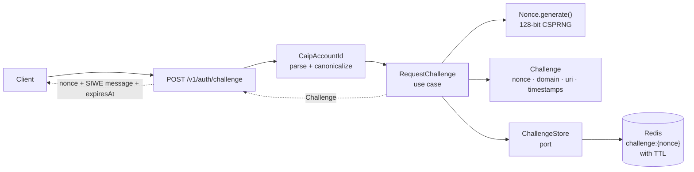

# Project Journal — Wallet Authentication Backend

## How this journal is maintained

- **Lean on git, tests, CLAUDE.md, and ARCHITECTURE.md for the mechanical record.**
  This journal captures what those can't: the *why*, the rejected alternatives, and the lessons.
- **Part 1** is updated only when the project's structure changes (new milestone, package added, roadmap revised).
- **Part 2** gets a new entry per step, written as part of the **same commit** as the code it describes — never as an afterthought.

---

## Part 1 — Big Picture

### What this backend does

This backend proves that a client controls the private key of a crypto wallet, then issues a login session. Its defining property is that it is **protocol-driven, not SDK-driven**: every wallet client — Reown AppKit, MetaMask, raw WalletConnect, or anything built later — reduces to the same three inputs: a `message`, a `signature`, and a claimed `accountId`. No wallet vendor's code or concepts appear anywhere in this backend. The protocol used for V1 is SIWE (EIP-4361), restricted to EVM chains and EOA (normal) wallets.

---

### M0 challenge-request flow

---

### Package map

| Package          | Job                                                                 | Milestone    |
|------------------|---------------------------------------------------------------------|--------------|
| `identity`       | `CaipAccountId`, `Namespace` — the wallet identity model            | M0 ✅        |
| `challenge`      | `Challenge`, `Nonce`, `ChallengeStore` (port), `ChallengePolicy`, `SiweMessageFactory` | M0 ✅ |
| `usecase`        | `RequestChallenge` (M0), `VerifyAndAuthenticate` (M1), `RefreshSession` + `Logout` (M2) | M0 partial ✅ |
| `infrastructure` | Redis adapters (`RedisChallengeStore`), JPA entities + repos, Flyway migrations | M0 partial ✅ |
| `config`         | Composition root — wires use cases to infrastructure, supplies `Clock` and `ChallengePolicy` beans | M0 ✅ |
| `api`            | REST controllers, request/response DTOs                             | M0 step 6 ⬜ |
| `verification`   | `SignatureVerifier` (interface), `EthereumSignatureVerifier`, SIWE parser | M1 ⬜  |
| `session`        | Access JWT, refresh token logic, `SessionStore` (port)              | M1–M2 ⬜    |
| `security`       | Spring Security config, JWT filter                                  | M1 ⬜        |

---

### Roadmap

| Milestone | Goal | Status |
|-----------|------|--------|
| **M0** | Project skeleton; CAIP-10 identity; Redis challenge store with atomic nonce; `/challenge` endpoint; docker-compose; ArchUnit guard | Steps 1–5 done ✅; step 6 (controller) next ⬜ |
| **M1** | SIWE parsing + full field validation; EOA `ecrecover`; signer-equals-claim check; identity upsert; access JWT. First end-to-end login | ⬜ |
| **M2** | Refresh tokens; rotation; reuse detection (family revocation); logout. Security audit pass | ⬜ |
| **M3** | Smart-contract wallets (EIP-1271 + EIP-6492); RPC dependency; per-`(chainId, address, msgHash)` caching. Likely triggers `verification` module split | ⬜ |
| **M4** | Second namespace (Solana / Ed25519) to prove and harden the abstraction; only then a real protocol registry | ⬜ |

Cross-cutting from M1 onward: rate limiting, audit logging, Testcontainers integration tests for the full auth flow.

---

## Part 2 — Step Log

---

## M1 · step 3 — `EthereumSignatureVerifier` (EOA ecrecover)   (commit <hash>)

**What:** Added `EthereumSignatureVerifier` in `verification`, implementing `SignatureVerifier`. It decodes the hex signature to 65 raw bytes (explicit per-character hex validation), normalises `v ∈ {0,1}` to `{27,28}`, constructs `Sign.SignatureData`, and calls web3j's `Sign.signedPrefixedMessageToKey` — which applies the EIP-191 prefix (`"\x19Ethereum Signed Message:\n{byteLen}"`) and Keccak-256 internally before recovering the public key via secp256k1 ecrecover. The recovered address (`Keys.getAddress(publicKey)`, lowercase, no 0x) is returned in `VerifiedIdentity`. `SignatureException` from web3j (invalid `v`, point not on curve) is wrapped as `VerificationException` — fail closed. `VerificationRequest` gained a `rawMessage` field (the exact wire bytes signed by the wallet). `EthereumSignatureVerifier` is wired as a bean in `UseCaseConfiguration` alongside the `VerifyAndAuthenticate` bean it powers. 7 tests in `EthereumSignatureVerifierTest`.

**Why the dependency is scoped to `org.web3j:crypto`:** Verified via `./gradlew dependencies --configuration runtimeClasspath`: the transitive closure is `web3j:abi`, `web3j:rlp`, `web3j:utils`, and `bcprov-jdk18on:1.78.1` (Bouncy Castle). No `web3j:core`, no OkHttp, no HTTP client of any kind. `web3j:core` (the RPC/JSON-RPC stack) is deferred to M3 when smart-contract wallet verification requires on-chain `eth_getCode` calls. Pulling it now would bring in a networking dependency with no current consumer.

**Why `VerificationRequest` needed `rawMessage`:** `EthereumSignatureVerifier` must hash the exact bytes the wallet signed. `SiweMessage` is a parsed record; reconstructing the original wire string from its fields would require duplicating `SiweMessageFactory`'s serialization logic in a second class. The raw string is already in scope in `VerifyAndAuthenticate.execute(rawMessage, signature)`, so passing it through as a second field on `VerificationRequest` is the minimal, correct approach.

**Why the ethers.js vector is the real test, not the web3j round-trip:** A test that signs with `Sign.signPrefixedMessage` and recovers with `EthereumSignatureVerifier` exercises two code paths in the same library. A shared bug in EIP-191 prefix handling (wrong byte-length encoding, wrong prefix string) would cause signing and recovery to use the same wrong hash — the recovered address would still match and the test would pass while every real wallet signature would fail. The fix: a hardcoded signature produced by ethers.js v6 (`wallet.signMessage`) with Hardhat account #0, recovered by web3j, asserting the result equals `0xf39Fd6…` (publicly documented address for that key). Cross-tool agreement on the hash is the actual correctness guarantee. The web3j round-trip is retained but explicitly labeled `verify_web3jRoundTrip_selfConsistent` so future readers understand its narrower role.

**The fail-closed finding:** `Numeric.hexStringToByteArray` does not throw on non-hex input. It calls `Character.digit(c, 16)`, which returns `-1` for invalid characters, and silently produces garbage bytes (`(byte)((-1 << 4) + (-1)) = 0xEF`). Without explicit per-character validation the `verify_nonHexSignature_throws` test — and the production fail-closed guarantee — would have silently broken. The explicit loop over the cleaned hex string was required.

**Learned:** Crypto-library round-trip tests are not the same as correctness tests. Self-consistency (sign with A, verify with A) proves the signing and recovery paths are inverse operations of each other under A's semantics. Cross-tool agreement (sign with B, verify with A, check against a published key) proves A implements the same semantics as the ecosystem. Both are needed; confusing them is a category error.

**Open / next:** Identity upsert — the recovered `CaipAccountId` needs to be upserted into `wallet_identity` in Postgres (first durable write in M1). Then access JWT issuance. Together these complete the end-to-end login flow.

---

## M1 · step 2 — `VerifyAndAuthenticate` use case + `SignatureVerifier` seam   (commit <hash>)

**What:** Added four types to `verification`: `SignatureVerifier` (the interface from ARCHITECTURE §8 — `VerifiedIdentity verify(VerificationRequest) throws VerificationException`), `VerificationRequest` (record: parsed `SiweMessage` + raw signature string), `VerifiedIdentity` (record: recovered signer address), and `VerificationException` (checked exception, single class). Added `VerifyAndAuthenticate` to `usecase` — pure Java, no Spring, constructor takes `ChallengeStore`, `ChallengePolicy`, `SignatureVerifier`, `Clock`. One `execute(rawMessage, signature)` method wires the full flow: parse → atomic consume → field validation → signature verify → signer match → derive `CaipAccountId`. `VerifyAndAuthenticateTest` has 10 tests: happy path + all security failure paths (nonce missing, nonce reused, wrong domain, wrong URI, wrong version, wrong chainId, message expired, issuedAt in future, signer mismatch).

**Why consume-before-verify:** if two concurrent `/verify` requests arrive with the same `(message, signature)`, both can pass `SiweMessageParser.parse()` before either touches Redis. If signature verification came first, both could recover the same valid signer address before either fires `GETDEL` — both would succeed. Consuming the nonce first means exactly one request gets the challenge back; the other gets empty and fails immediately. There is no window between the GETDEL and the signature check where replay is possible. This is architecture rule #6.

**Why field validation splits its source of truth:** `domain`, `uri`, and `version` are checked against the live `ChallengePolicy`, not the stored challenge. The policy is the server's authoritative configuration; if policy changed between issuance and verification (rolling deploy), the policy value wins. `chainId` and nonce consistency are checked against the consumed `Challenge` — the specific issuance record — because those fields are per-issuance context, not global policy. Using the wrong source for either check would either allow a stale-policy bypass or break legitimate requests during a deploy.

**Why `SignatureVerifier` is the test seam:** the interface exists solely so that `VerifyAndAuthenticate` can be exercised without any crypto. With a one-liner lambda stub (`request -> new VerifiedIdentity(address)`), all 10 tests — including every security failure path — run in under 100ms. The real `EthereumSignatureVerifier` (next step) slots in without touching this orchestration code. This is the one allowed interface (rule of three applied): it earns its keep as a test seam, not as a future-protocol abstraction.

**Why zero clock-skew tolerance on issuedAt/expiresAt:** `issuedAt` and `expiresAt` in V1 are server-issued values that round-trip back verbatim — the server sets them in the challenge, embeds them in the SIWE message, and receives them back unchanged. A tampered timestamp would invalidate the wallet's signature over the original plaintext, so ecrecover already catches that case. A legitimate client has no reason for the timestamps to drift from what was issued. Clock-skew tolerance (deferred in ARCHITECTURE §10) only matters if a client ever *supplies* its own timestamps — which V1 clients don't. Zero tolerance is correct here, not conservative.

**Learned:** The consume-first ordering is not just a concurrency fix — it is the definition of single-use. "Single-use" is a property of the *consume* operation, not of a subsequent check that the nonce hasn't been seen before. Once you see it that way, consume-first is the only coherent design.

**Open / next:** M1 step 3 — `EthereumSignatureVerifier` (EOA `ecrecover`). Introduces the first crypto dependency (web3j or Bouncy Castle). The `equalsIgnoreCase` signer comparison in step 5 of `VerifyAndAuthenticate` becomes proper address canonicalization (both sides lowercased via `CaipAccountId.of`). Also begins the identity-upsert path: recovered `CaipAccountId` → `WalletIdentity` upsert in Postgres (first durable write in M1).

---

## M1 · step 1 — SIWE parser: `SiweMessage` + `SiweMessageParser`   (commit <hash>)

**What:** Added two classes to the `verification` package. `SiweMessage` is an immutable record with eight fields (`domain`, `address`, `uri`, `version`, `chainId`, `nonce`, `issuedAt`, `expiresAt`); its compact constructor rejects null/blank strings and null instants, and deliberately does **not** canonicalize the address — that is verification's job, not the parser's. `SiweMessageParser` is a pure Java class (zero Spring imports) with one static method `parse(String)`. It splits on `\n` with `-1` limit, hard-fails on anything other than exactly 10 lines, validates each line's prefix, checks that lines 2 and 3 are empty, and wraps `DateTimeParseException` in `IllegalArgumentException`. `SiweMessageParserTest` has 7 tests: two round-trips (whole-second and sub-second instants) plus five malformed-input cases (too few lines, too many lines, missing prefix, garbage timestamp, non-empty blank line).

**Why `SiweMessage` is separate from `Challenge`:** they sit at different trust levels. `Challenge` is produced *by* the server — every field in it is authoritative. `SiweMessage` is produced *by parsing a string that arrived from the client at verify time* — it carries only what the wire says, no guarantees. Mixing the two types would conflate "what we issued" with "what we received," making it easy to accidentally skip the step where the two are compared. Separate types make the comparison explicit and mandatory.

**Why strict 10-line parsing (fail-closed):** the parser only needs to accept messages this server produced. Permissive parsing (optional fields, variable line counts) widens the attack surface: an adversary who can craft a message that parses without error but whose fields the server didn't issue is halfway to a bypass. Failing on anything outside the exact format we emit means the parse step is a hard gate, not a best-effort reader.

**Why the sub-second round-trip test:** `clock.instant()` in production returns nanosecond-resolution timestamps, not whole seconds. `Instant.toString()` preserves sub-second precision (e.g. `2026-06-15T12:00:00.123456Z`), and `Instant.parse` round-trips it losslessly. The whole-second test passes trivially; the sub-second test guards the actual production path. Without it, a parser that truncated fractional seconds would appear correct in tests and silently fail in production every time an issuedAt/expiresAt compared unequal.

**Learned:** `Instant.parse` + `Instant.toString` are a lossless round-trip at nanosecond resolution — no custom formatter needed. The sub-second test is the kind that should be written first, before the simpler whole-second case, precisely because it reflects the real production data shape.

**Open / next:** `SiweMessageParser` produces a `SiweMessage` but performs no field validation — no domain check, no nonce lookup, no expiry check, no signature verification. Those belong to `VerifyAndAuthenticate` (M1 step 2), which will call the parser, consume the nonce from Redis, validate each field against the stored challenge, then pass to `EthereumSignatureVerifier`.

---

## M0 · step 6 — POST /v1/auth/challenge endpoint   (commit 50288c3)

**What:** Added the `api` package: `ChallengeRequest` (`@NotBlank accountId`), `ChallengeResponse` (nonce + SIWE message + expiresAt), `ChallengeController` (`POST /v1/auth/challenge` → 201), and `GlobalExceptionHandler` (`IllegalArgumentException` → 400 JSON). The controller parses the CAIP-10 string via `CaipAccountId.parse()`, delegates to `RequestChallenge`, then formats the SIWE message via `SiweMessageFactory.create()`. `ChallengeControllerTest` uses `MockMvcBuilders.standaloneSetup()` with a real `LocalValidatorFactoryBean` and covers: valid request → 201 body, blank accountId → 400, missing accountId → 400, malformed CAIP-10 → 400 with `{"error":...}`.

**Why:** `@WebMvcTest` does not exist in Spring Boot 4 — the test-autoconfigure jar carries only `jdbc` and `json` slices. `standaloneSetup()` from `spring-test` (Spring Framework 7) is the correct replacement: it wires the controller, advice, and validator without a Spring context, keeping the test fast and the dependency on Boot test infrastructure at zero. `@ResponseStatus(CREATED)` is 201 because a challenge resource was created in Redis; 200 would imply a read-only query.

**Learned:** Always verify a test annotation exists before using it — `@WebMvcTest` being absent wasn't obvious from the `build.gradle.kts`, only from inspecting the jar. For Spring Boot 4 controller tests, `standaloneSetup` + `LocalValidatorFactoryBean` + `setControllerAdvice` replicates what `@WebMvcTest` did, with no magic.

**Open / next:** `GlobalExceptionHandler` currently maps only `IllegalArgumentException`. It will grow as M1 adds `VerificationException` and as we add a handler for Spring's `MethodArgumentNotValidException` to return a consistent error shape for `@Valid` failures (currently Spring's default 400 body leaks internal field names).

---

## M0 · housekeeping — Learning journal created   (commit 8a4f354)

**What:** Added `docs/JOURNAL.md` — a two-part learning journal built from the git history and source files, not from session memory. Part 1 holds the big picture (project summary, M0 challenge-flow flowchart, package map, M0–M4 roadmap). Part 2 has one backfilled entry per committed step (M0 steps 1–5 plus the two step-5 follow-ups), written from the actual diffs.

**Why:** `git log` and the code record *what* was built. The journal captures what they can't: the rejected alternative in each decision, and the engineering lesson it produced. Keeping it in `docs/` and committing each entry with its code means the record stays honest — no afterthought rewrites of what "we always intended."

**Learned:** Writing the step entries from diffs rather than memory surfaces gaps. The step 5 follow-up entries revealed that the entropy assertion was split across two commits because it was first applied to `NonceTest` and only later caught as missing from `RequestChallengeTest` — which is itself a lesson about checking all test files for the same TODO before closing a deferred item.

**Open / next:** Part 2 needs a new entry per step going forward. The rule is: same commit as the code, never retroactively.

---

## M0 · step 5 follow-up (addendum) — Entropy assertion in RequestChallengeTest   (commit aa39ba2)

**What:** Added a byte-length assertion to `execute_generatesDifferentNonceOnEachCall` in `RequestChallengeTest`. The test previously only checked that 100 draws produced 100 distinct strings. Now it also base64url-decodes one nonce and asserts exactly 16 raw bytes.

**Why:** Uniqueness and unpredictability are different properties. A sequential counter produces unique values but is trivially predictable. The byte-length check ensures that any future weakening of `Nonce.generate()` — shorter output, different encoding, counter-based implementation — would fail the test even if the strings happened to be distinct.

**Learned:** When writing security tests, ask "what property am I actually guarding?" Uniqueness is a liveness property; unpredictability / entropy is a safety property. A test suite that conflates them gives false confidence.

**Open / next:** The concurrency test in `RedisChallengeStoreTest` (N threads consume the same nonce, assert exactly one success) is still deferred — tracked by the TODO comment added in step 4 addendum.

---

## M0 · step 5 follow-up — Nonce entropy assertion + Clock bean extracted   (commit e5a8302)

**What:** Two cleanup items deferred from step 5. (1) `NonceTest` gained an explanatory comment on encoding (base64url-no-pad), raw byte length (≥16 = 128 bits), and why that matters (replay defense — uniqueness ≠ unpredictability). The assertion was also tightened to check `decoded.length` directly rather than `decoded.length * 8`. (2) The `Clock` `@Bean` was moved out of `UseCaseConfiguration` into a new `ClockConfiguration` class.

**Why:** A clock is an app-level primitive; leaving it in `UseCaseConfiguration` would mean any future config class that needs a `Clock` has to declare a dependency on use-case wiring. The separation keeps each `@Configuration` class cohesive around a single concern.

**Learned:** `@Configuration` classes have a "job." When a bean doesn't belong to the job, it creates an invisible coupling: future engineers have to know to look there. Extract early, before the second caller appears.

**Open / next:** Entropy assertion still missing from `RequestChallengeTest` (addressed in the addendum commit above).

---

## M0 · step 5 — RequestChallenge use case + composition-root wiring   (commit ca0e753)

**What:** Added `RequestChallenge` — a plain Java class (no Spring annotations) that generates a nonce, builds a `Challenge` with `issuedAt` from an injected `Clock` and `expiresAt = issuedAt + policy.nonceTtl()`, stores it via `ChallengeStore`, and returns it. Added `UseCaseConfiguration` (`@Configuration`) as the composition root that wires the use case to its dependencies. `RequestChallengeTest` exercises the stored fields and the nonce-uniqueness property.

**Why:** The use case is kept Spring-free deliberately — `usecase` is a core package and the ArchUnit guard will prohibit Spring imports there. Wiring happens exclusively in `config`, which is allowed to import both core and infrastructure. The alternative (annotating `RequestChallenge` with `@Service`) would quietly break the layer boundary.

**Learned:** "Composition root" is a precise concept: one place in the app where framework wiring is allowed to touch core code. Keeping it explicit in its own package makes that boundary visible and enforceable.

**Open / next:** Nonce test was uniqueness-only (entropy/length deferred). Clock bean was inside `UseCaseConfiguration` (extraction deferred). Both addressed in the follow-up commits.

---

## M0 · step 4 (addendum) — Concurrency TODO in RedisChallengeStoreTest   (commit 5eab9bc)

**What:** Added a `TODO` comment in `RedisChallengeStoreTest` documenting the deferred concurrency regression-guard test: N threads consuming the same nonce should assert exactly one success. No code changed.

**Why:** The sequential `consumeIsSingleUse` test proves single-use semantics in the happy path. It does not guard against a future refactor that replaces `GETDEL` with a `GET`-then-`DEL` pair, which would be a real atomicity regression. The TODO pins the intent before it can be forgotten.

**Learned:** Deferred tests should be documented at the call site, not just in a backlog. A comment next to the thing it guards is harder to lose than a ticket.

**Open / next:** The concurrency test itself — still deferred.

---

## M0 · step 4 — Redis ChallengeStore with atomic GETDEL consume   (commit 02b949f)

**What:** Added `RedisChallengeStore` (implements `ChallengeStore`). `store()` uses `SET key value PX millis` — value plus TTL in one command. `consume()` uses Redis `GETDEL` (atomic, Redis 6.2+) so a nonce can only be retrieved and deleted in a single operation. Added `RedisChallengeRecord` as a flat JSON shape for serialization (Jackson), keeping JSON concerns out of core packages. `ChallengePolicy` is bound from `application.yml` via `@ConfigurationProperties`. `RedisChallengeStoreTest` runs against a real Redis 7 container via Testcontainers.

**Why:** `GET` then `DEL` is a race condition: two concurrent verify requests could both `GET` the nonce (both succeed), before either `DEL` fires. `GETDEL` makes retrieve-and-delete a single atomic server-side operation. This is architecture rule #6. The alternative — a Lua script — achieves the same guarantee but `GETDEL` is cleaner when available.

**Learned:** A test that says "two sequential calls, second returns empty" is not the same as "two concurrent calls, exactly one succeeds." Sequential single-use is easy; concurrency correctness is a property of the *implementation strategy* (`GETDEL`), not the test. The test proves the happy-path guarantee; the implementation strategy is what makes it hold under concurrency.

**Open / next:** Concurrent regression-guard test deferred (see step 4 addendum).

---

## M0 · step 3 — Challenge model, ChallengePolicy, SIWE message factory   (commit 36c04e9)

**What:** Added `Challenge` (record with compact constructor validation), `ChallengePolicy` (server-authoritative domain + uri + nonce TTL), `ChallengeStore` (port interface — `store` + `consume`), `Nonce` (16-byte CSPRNG, base64url-no-pad), and `SiweMessageFactory` (produces the canonical EIP-4361 plaintext). `SiweMessageFactoryTest` has two tests: a line-by-line array check and a full-string equality check against an EIP-4361 ABNF-derived reference string — both constructed independently of the factory to avoid a circular assertion. The reference test pins a non-obvious spec detail: when `statement` is absent, the ABNF yields `address LF + LF (absent statement) + LF (separator)`, producing **two blank lines** between the address and `URI:`. This matches the spruceid/siwe reference implementation and is easy to get wrong.

**Why:** The spec-pinned test exists because the SIWE message format is load-bearing: the client signs exactly this string, and the verifier (M1) will parse exactly this string. A test that calls the factory and then checks the factory's own output (circular) proves nothing. The expected string in the test is built directly from the EIP-4361 spec, so a regression in the factory's formatting fails the test.

**Learned:** For protocol-format code, derive the expected value from the spec, not from the code under test. Circular tests give green results even when the output is wrong.

**Open / next:** `ChallengeStore` is a port with no implementation yet (filled in step 4). `expiresAt` derives from `issuedAt + nonceTtl` — clock-skew tolerance at verify time is deferred to M1.

---

## M0 · step 2 — CaipAccountId + Namespace value objects   (commit bff1d2a)

**What:** Added `Namespace` (enum with `EIP155`, carrying the string value `"eip155"`) and `CaipAccountId` (an immutable value object for CAIP-10 account identifiers: `namespace:reference:address`). Construction validates format and canonicalizes the EVM address to lowercase. `CaipAccountId.identityKey()` returns `(namespace, address)`, explicitly separating identity from chain context. Both have unit tests covering happy paths, malformed input, and the case-normalization invariant.

**Why:** The alternative was to model identity as `(walletAddress, provider, chainId)` — which is how most Web3 auth examples are written. That model would create a separate identity for the same wallet on Ethereum vs Polygon, forcing the session layer to handle cross-chain merging later. Modelling identity as `(namespace, address)` and chain as session context avoids that problem by design. The address must be canonicalized inside the value object's constructor so the invariant cannot be bypassed.

**Learned:** Identity key design is a foundational decision that propagates everywhere — database schema, token claims, session lookup. Getting it wrong early means refactoring across all layers. The correct key for an EVM wallet is `(namespace, address)`: one physical key, all chains.

**Open / next:** `Namespace` currently hardcodes EVM validation (address regex, decimal reference). Non-EVM namespaces (Solana) are M4 scope.

---

## M0 · step 1 — Gradle + Spring Boot bootstrap, package skeleton   (commit 8fa6ccf)

**What:** Initialized a single-module Gradle build (Kotlin DSL), Spring Boot 4.1.0 application, and an empty package skeleton (`identity`, `challenge`, `verification`, `session`, `usecase`, `infrastructure`, `security`, `api`) with `package-info.java` files describing each package's purpose. `application.yml` configured Spring Security to a stateless, permit-all posture (no sessions, no login page) as the correct baseline for a token-issuing API. `CLAUDE.md` and `docs/ARCHITECTURE.md` were written at this step.

**Why:** The package skeleton establishes the layering before any code exists, so every subsequent addition lands in the right place by default. Starting with a "deny by default" security posture (`SessionCreationPolicy.STATELESS`, explicit `authorizeHttpRequests`) is safer than starting open and trying to lock down later — there is no moment at which a half-locked config is accidentally deployed.

**Learned:** Write the architecture doc before the first line of production code. It forces you to make the hard decisions (identity model, ephemeral vs durable split, session design) while there is nothing to migrate.

**Open / next:** All packages are empty stubs. Everything starts in step 2.

---

## M0 · closer — SecurityFilterChain + isolation test   (commit <hash>)

**What:** Added `SecurityConfiguration` (the `SecurityFilterChain` bean that was described in `security/package-info.java` but never actually written): `/v1/auth/**` and `/actuator/health/**` permitted, everything else `authenticated()`, `STATELESS` sessions, CSRF/httpBasic/formLogin disabled, and an `HttpStatusEntryPoint(UNAUTHORIZED)` so unauthenticated requests get 401, not Spring's default 403. Added `SecurityConfigurationTest` — a sliced `@SpringBootTest(classes = {SecurityConfiguration, <stub controller>})` with `@ImportAutoConfiguration(ServletWebSecurityAutoConfiguration.class)`, MockMvc built via `webAppContextSetup(wac).apply(springSecurity())`, asserting: public path reaches the controller, POST is not CSRF-blocked and sets no JSESSIONID, unknown path → 401.

**Why:** The posture was *documented* but not *implemented* — it surfaced only when a live `POST /v1/auth/challenge` returned 401 (then 403) against the running app. Default Boot security (no `SecurityFilterChain` bean → authenticate-everything + JSESSIONID) was active the whole time. The 401-vs-403 entry point is a real API-contract decision (token clients branch on 401 to re-auth), made deliberately, not to satisfy a test. The test is sliced to `classes={...}` to test security *in isolation*: no component scan, so no `RedisChallengeStore` / infra beans, so it breaks only when security changes — not when unrelated beans do. Getting `HttpSecurity` available in that slice required pulling back exactly one autoconfig (`ServletWebSecurityAutoConfiguration`, which carries `@EnableWebSecurity` → `HttpSecurityConfiguration` → the `HttpSecurity` prototype bean).

**Learned:** A "stateless, permit-all" posture cannot be set via `application.yml` in Boot 4 (that mechanism died in Boot 1.x) — it needs a `SecurityFilterChain` bean. "BUILD SUCCESSFUL" proved nothing here; the proof was the test passing with `docker compose down` (context boots with no DB/Redis = security genuinely isolated from persistence). Disabling httpBasic+formLogin flips the default entry point to 403; 401 must be set explicitly. Slicing a `@SpringBootTest` too thin removes the framework's own infra (`HttpSecurity`) — the fix is `@ImportAutoConfiguration` of the specific autoconfig, not adding it to `classes`.

**Open / next:** Two M0 closers remain — `MethodArgumentNotValidException` handler (clean `@Valid` error bodies) and the deferred GETDEL concurrency test. `SecurityConfiguration` itself has no unit test beyond the slice test (acceptable for a config bean). `docs/scratch/` recon notes are untracked — delete or gitignore.
